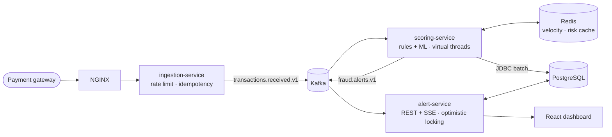

# Real-Time Fraud Detection & Alerting Platform

[](.github/workflows/ci.yml)
  

An open-source reference implementation of a card-fraud detection pipeline. Transactions are ingested through a REST API, streamed through **Kafka**, scored by **rules plus an ML model**, cached in **Redis**, persisted to **PostgreSQL**, and surfaced live in a **React** dashboard.

The repo is built **spec-first and test-first, one feature at a time**. Every architectural concept it uses is documented with diagrams, trade-offs and interview Q&A, so it doubles as a backend system-design study guide.



➡️ Full architecture with C4, sequence, ER and deployment diagrams: **[docs/architecture](docs/architecture/README.md)**

---

## Concepts demonstrated

| Concept | Deep dive | Feature |
|---------|-----------|---------|
| Event-driven decoupling with Kafka | [01](docs/concepts/01-event-driven-kafka.md) | ✅ 001 · ✅ 003 |
| Distributed caching with Redis | [02](docs/concepts/02-distributed-caching-redis.md) | ✅ 005 |
| N+1 queries and composite indexing | [03](docs/concepts/03-n-plus-one-and-composite-indexing.md) | ✅ 004 · ✅ 007 |
| JDBC batch processing | [04](docs/concepts/04-jdbc-batch-processing.md) | ✅ 004 |
| Two-layer concurrent-write protection | [05](docs/concepts/05-two-layer-concurrent-write-protection.md) | ✅ 007 |
| Distributed rate limiting | [06](docs/concepts/06-distributed-rate-limiting.md) | ✅ 002 |
| JDK 21 virtual threads | [07](docs/concepts/07-virtual-threads.md) | ✅ 001 · ✅ 009 |
| Threads, semaphores, locks, CompletableFuture | [08](docs/concepts/08-concurrency-primitives.md) | ✅ 005 · 006 · 009 |
| Load testing with Gatling | [09](docs/concepts/09-load-testing-gatling.md) | ✅ 013 |
| CI/CD pipeline | [10](docs/concepts/10-ci-cd-pipeline.md) | ✅ 000 · ✅ 014 |
| Load balancing | [11](docs/concepts/11-load-balancing.md) | ✅ 011 |
| Idempotency & exactly-once | [12](docs/concepts/12-idempotency-and-exactly-once.md) | ✅ 002 · 003 · 004 · 010 |
| Resilience: retries, DLT, circuit breaker, outbox | [13](docs/concepts/13-resilience-patterns.md) | ✅ 010 |
| Observability | [14](docs/concepts/14-observability.md) | ✅ 012 |
| ML in production: feature parity, blending, degradation | [15](docs/concepts/15-ml-in-production.md) | ✅ 006 |

## How this repo is built

| Practice | Where |
|----------|-------|
| **Spec-driven development**: spec → plan → tasks per feature, acceptance criteria with IDs | [`specs/`](specs/README.md) |
| **Test-driven development**: every test names the acceptance criterion it proves (`AC-001-03`) | `*Test`, `*IT` |
| **Hexagonal architecture**, enforced by ArchUnit | [`HexagonalArchTest`](ingestion-service/src/test/java/com/fraudplatform/ingestion/architecture/HexagonalArchTest.java) |
| **Architecture Decision Records** | [`docs/adr/`](docs/adr/README.md) |
| **Real infrastructure in tests** (Testcontainers, no H2/embedded fakes) | [ADR-0005](docs/adr/0005-testcontainers-over-in-memory-fakes.md) |
| **Engineering rules & Definition of Done** | [`docs/constitution.md`](docs/constitution.md) |

## Roadmap

| # | Feature | Status |
|---|---------|--------|
| 000 | Project foundation | ✅ |
| 001 | Transaction ingestion API → Kafka | ✅ |
| 002 | Distributed rate limiting & idempotency | ✅ |
| 003 | Rule-based scoring engine | ✅ |
| 004 | Persistence: JDBC batch, indexes | ✅ |
| 005 | High-risk account cache | ✅ |
| 006 | ML-assisted scoring | ✅ |
| 007 | Alert management API | ✅ |
| 008 | React dashboard | ✅ |
| 009 | Concurrency deep dive | ✅ |
| 010 | Resilience | ✅ |
| 011 | Load balancing | ✅ |
| 012 | Observability | ✅ |
| 013 | Gatling load tests | ✅ |
| 014 | CI/CD pipeline | ✅ |
| 015 | Security | ✅ |

Details and dependency graph: [specs/README.md](specs/README.md)

## Quick start

**Prerequisites:** JDK 21, Docker. Maven comes from the wrapper.

```bash
# 1. Build and run all tests (integration tests need Docker running)
./mvnw verify

# 2a. Start infrastructure only (run services from your IDE / mvn)
docker compose -f infra/docker-compose.yml up -d

# 2b. …or the whole load-balanced platform: 3×ingestion, 3×scoring, 2×alerts behind NGINX
#     (dashboard + APIs on http://localhost:8080) plus Grafana :3000, Prometheus :9090,
#     Jaeger :16686, with an end-to-end smoke test
infra/smoke-test.sh

# 3. Run the services (separate terminals)
./mvnw -pl ingestion-service spring-boot:run
./mvnw -pl scoring-service spring-boot:run
./mvnw -pl alert-service spring-boot:run

# 3b. Run the dashboard on http://localhost:8080 (the dev server stands in for the gateway);
#     sign in as analyst/analyst or supervisor/supervisor
(cd dashboard && npm install && npm run dev)

# 4. Submit a transaction
#    Every API needs an OAuth2 token (Feature 015). Get one as the "payment-gateway" client from
#    Keycloak (dev-only secret; users and clients are listed in infra/keycloak/README.md):
TOKEN=$(curl -s -d grant_type=client_credentials -d client_id=payment-gateway \
  -d client_secret=dev-only-not-a-secret-gateway \
  localhost:8180/realms/fraud/protocol/openid-connect/token | sed -E 's/.*"access_token":"([^"]+)".*/\1/')
curl -i -X POST localhost:8081/api/v1/transactions \
  -H 'Content-Type: application/json' \
  -H "Authorization: Bearer $TOKEN" \
  -H "Idempotency-Key: $(uuidgen)" \
  -d '{
        "transactionId": "txn-0001",
        "accountId": "acc-1001",
        "amount": 249.99,
        "currency": "USD",
        "merchantId": "m-5541",
        "merchantCategoryCode": "5732",
        "country": "US",
        "channel": "CARD_NOT_PRESENT",
        "occurredAt": "2026-10-09T18:15:30Z"
      }'
# → HTTP/1.1 202 Accepted  {"transactionId":"txn-0001","eventId":"…","status":"ACCEPTED",…}

# 5. Watch it land in Kafka (Kafka UI on http://localhost:8090)
docker compose -f infra/docker-compose.yml --profile tools up -d kafka-ui
```

| Command | Runs |
|---------|------|
| `./mvnw test` | Unit, slice, contract and architecture tests (no Docker) |
| `./mvnw verify` | All of the above, plus Testcontainers integration tests and the coverage gate |
| `cd dashboard && npm test` | Dashboard component tests (Vitest + Testing Library + MSW) |
| `./mvnw -pl load-tests gatling:test -Dgatling.simulationClass=com.fraudplatform.load.BaselineSimulation -Drate=500` | Load test against the running stack (see [concept 09](docs/concepts/09-load-testing-gatling.md)) |

## Repository layout

```
├── common/                 Shared Kafka event contracts (records only)
├── platform-messaging/      Shared infra: transactional outbox, jittered backoff, DLT replay (010)
├── platform-security/       Shared infra: Keycloak JWT role mapping, SSE token resolver, PII masking (015)
├── test-support/           Shared Testcontainers images + Kafka/Redis test helpers
├── ingestion-service/      REST → Kafka, rate limiting, idempotency (001, 002)
│   └── src/main/java/…/ingestion/
│       ├── api/            controllers, DTOs, ProblemDetail handler
│       ├── application/    use cases + ports (framework-free)
│       ├── domain/         pure business model
│       └── infrastructure/ Kafka adapter, wiring, config
├── scoring-service/        Kafka → rules → Postgres (JDBC batch) → fraud.alerts.v1, risk cache (003–005)
├── ml/                     Model training (Python): synthetic data → logistic regression → JSON (006)
├── alert-service/          Analyst queue: Kafka → JPA, keyset paging, Redis lock + @Version (007)
├── dashboard/              React 19 + TS analyst console: live SSE queue, review actions (008)
├── concurrency-lab/        Executable concurrency notes: measured, asserted examples (009)
├── load-tests/             Gatling simulations (baseline, spike, soak, failover, smoke) (013)
├── k8s/                    Kustomize manifests (base + CI overlay), post-deploy smoke test (014)
├── config/                 Checkstyle rules
├── infra/                  docker-compose (infra + `app` profile), NGINX gateway, Dockerfile, smoke test
├── docs/
│   ├── constitution.md     engineering rules & Definition of Done
│   ├── architecture/       diagrams
│   ├── adr/                decision records
│   └── concepts/           concept deep dives + interview Q&A
└── specs/                  feature specs (spec → plan → tasks)
```

## License
MIT
