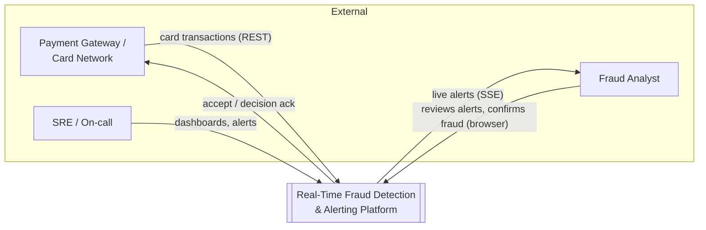
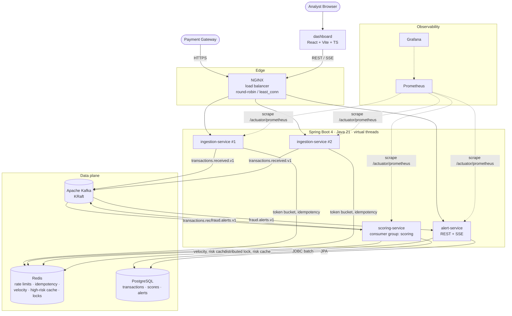
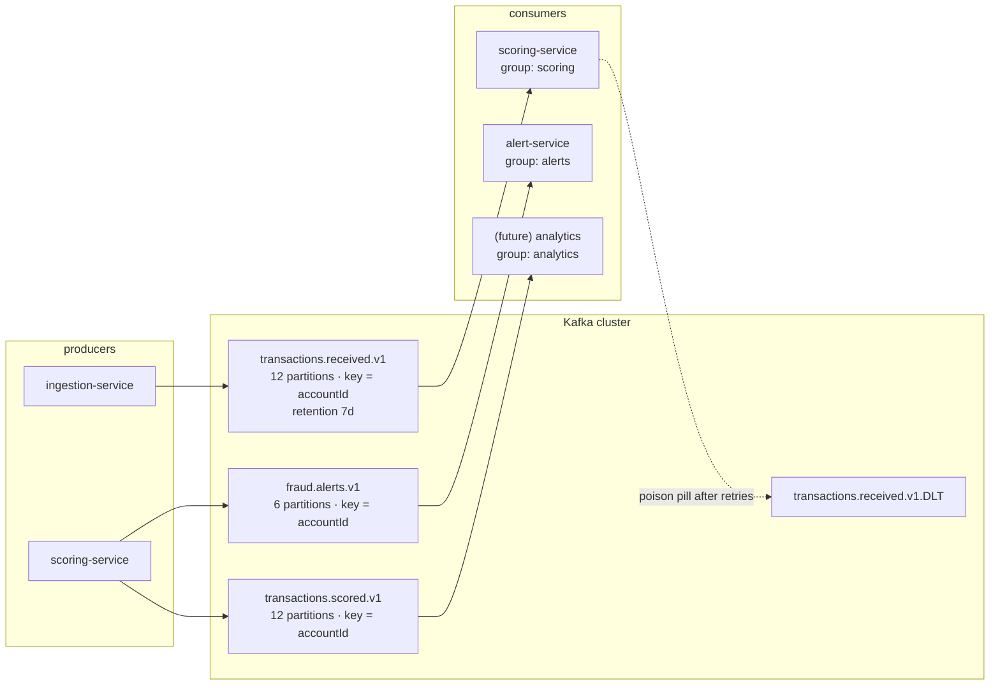
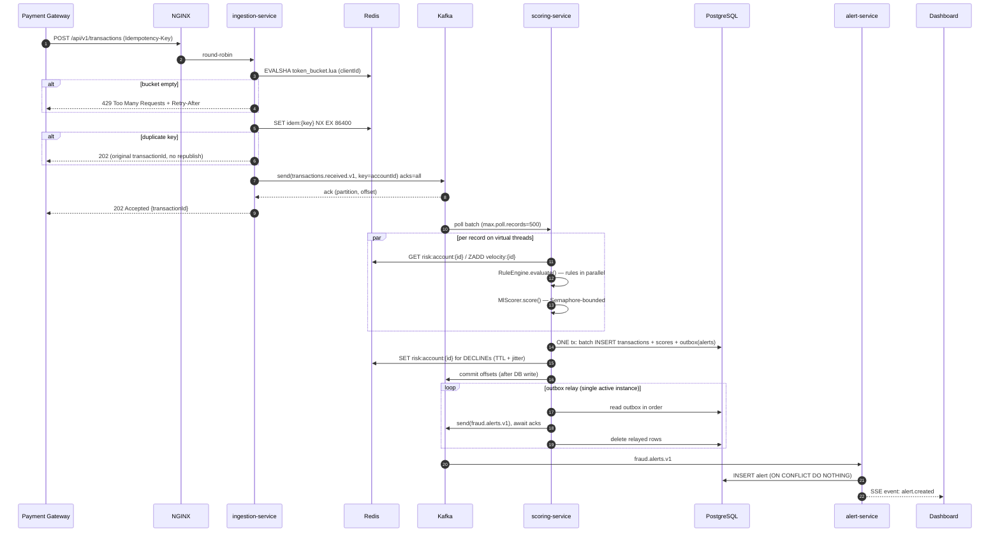
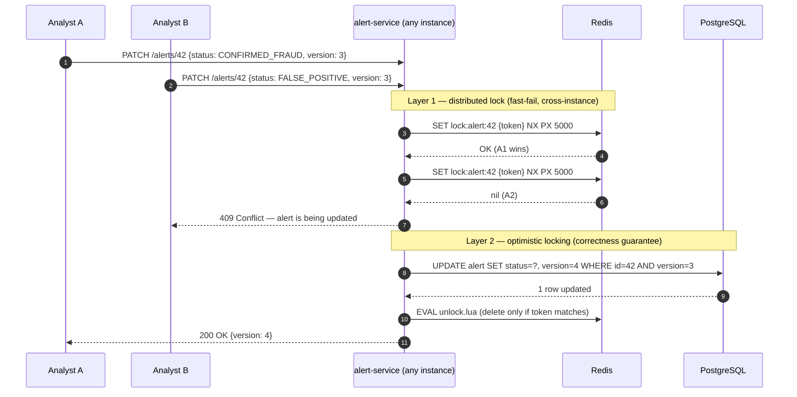
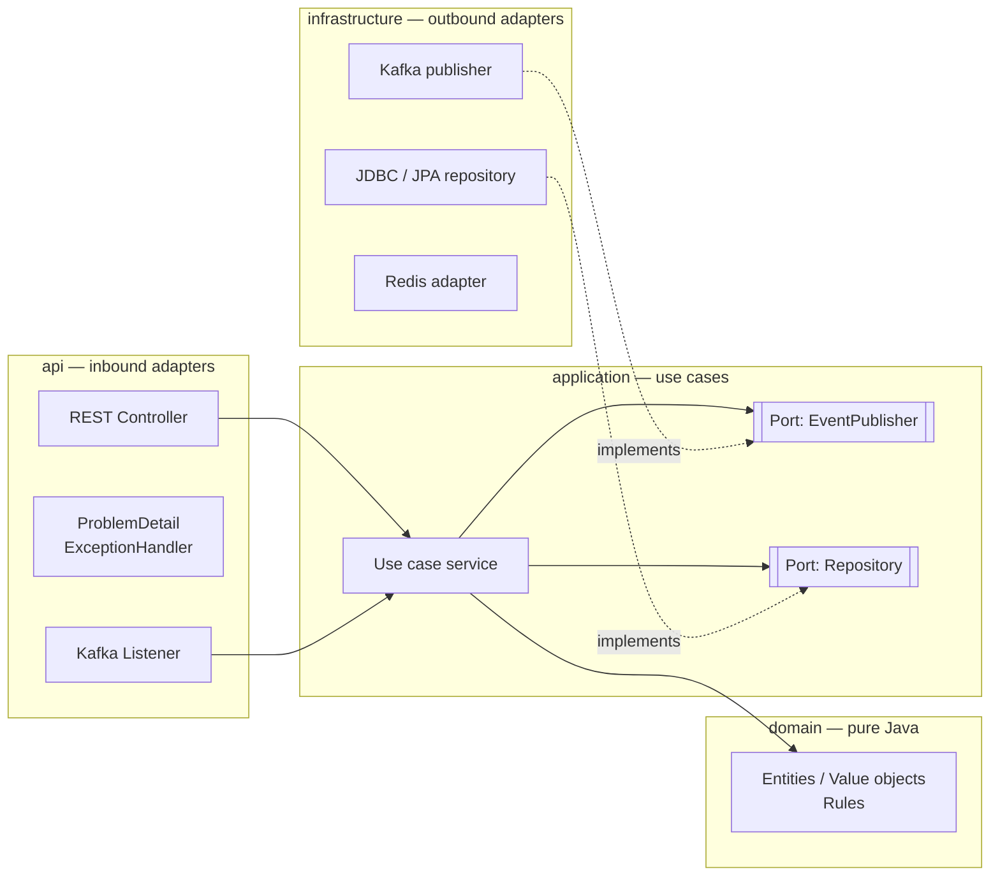
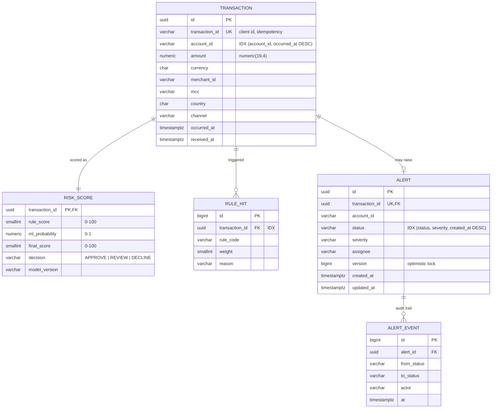
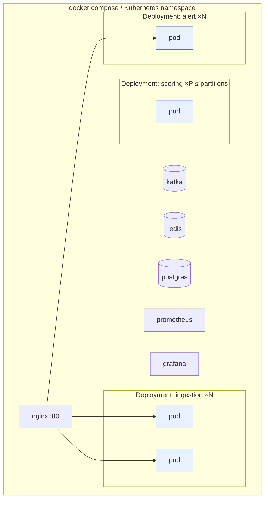

# Architecture

This document describes the **target** architecture. Each feature spec in [`/specs`](../../specs) delivers one slice of it, and the status column in the [roadmap](../../specs/README.md) shows what exists today.

- [1. System context](#1-system-context)
- [2. Containers](#2-containers)
- [3. Event flow & Kafka topology](#3-event-flow--kafka-topology)
- [4. Scoring pipeline (sequence)](#4-scoring-pipeline-sequence)
- [5. Alert review with two-layer concurrency control (sequence)](#5-alert-review-with-two-layer-concurrency-control-sequence)
- [6. Hexagonal service layout](#6-hexagonal-service-layout)
- [7. Data model](#7-data-model)
- [8. Redis key space](#8-redis-key-space)
- [9. Deployment](#9-deployment)
- [10. Quality attributes](#10-quality-attributes)

---

## 1. System context

## 2. Containers

| Container | Responsibility | Scales by |
|-----------|----------------|-----------|
| **ingestion-service** | Validates transactions, enforces per-client rate limits and idempotency, publishes to Kafka. Stateless. | Instances behind the LB |
| **scoring-service** | Consumes transactions and runs **rule-based + ML** scoring. Persists the result with JDBC batching, emits alerts, and keeps the high-risk account cache up to date. | Kafka partitions (one consumer thread per partition) |
| **alert-service** | Consumes alerts and serves the analyst API: paginated queries, the alert lifecycle with concurrent-write protection, and an SSE push stream. | Instances behind the LB |
| **dashboard** | React SPA: live alert feed, alert queue, review actions, KPIs. | CDN / static hosting |

**Why separate services?** Ingestion has to stay fast and available even when scoring is slow, and Kafka between them absorbs bursts. The two sides also have different scaling dimensions (HTTP connections vs partitions). See [ADR-0003](../adr/0003-service-decomposition.md).

## 3. Event flow & Kafka topology

**Key design choices**

| Choice | Reason |
|--------|--------|
| Partition key = `accountId` | All events for one account land on one partition, so they are processed **in order** by one consumer. Velocity rules depend on that ordering. |
| Producer `acks=all`, `enable.idempotence=true` | No message loss, and no duplicates caused by producer retries. |
| Versioned topic names (`.v1`) | Breaking schema changes go to a new topic, and consumers migrate on their own schedule. |
| JSON payloads with a `schemaVersion` field, and contracts in the shared `common` module | Simple and readable. A schema registry with Avro or Protobuf is the documented upgrade path ([ADR-0002](../adr/0002-kafka-as-event-backbone.md)). |
| Consumer is idempotent (dedupe on `eventId`) | Kafka gives **at-least-once** delivery. Combined with idempotent processing, the effect is exactly-once. |

## 4. Scoring pipeline (sequence)

## 5. Alert review with two-layer concurrency control (sequence)

Two analysts can open the same alert at the same moment. The platform must never lose an update, and it must never let both of them "win".

The Redis lock is an *optimisation*: it rejects contention cheaply and avoids wasted work. The `version` column is the *guarantee*: if the lock expires (GC pause, network partition), the `WHERE version = ?` predicate still rejects the stale write. Details are in [concept 05](../concepts/05-two-layer-concurrent-write-protection.md).

## 6. Hexagonal service layout

Dependencies point **inward**. The rules are enforced by ArchUnit tests in every service (`*ArchTest`).

## 7. Data model

**Indexing strategy** (detail in [concept 03](../concepts/03-n-plus-one-and-composite-indexing.md)):

| Query | Index | Why this column order |
|-------|-------|-----------------------|
| Recent transactions for account (velocity, history) | `(account_id, occurred_at DESC)` | Equality column first, then range/sort column. One index range scan, no sort step. |
| Analyst queue: open alerts by severity, newest first | `(status, severity, created_at DESC)` | Matches `WHERE status=? AND severity=? ORDER BY created_at DESC LIMIT ?` exactly |
| Partial index for the hot path | `(created_at DESC) WHERE status = 'OPEN'` | Small index, because closed alerts are ~95% of rows |

## 8. Redis key space

| Key pattern | Type | TTL | Owner | Purpose |
|-------------|------|-----|-------|---------|
| `rl:{clientId}` | Hash (`tokens`, `ts`) | auto | ingestion | Token-bucket rate limiter (Lua, atomic) |
| `idem:{idempotencyKey}` | String | 24h | ingestion | Idempotent POST |
| `velocity:{accountId}` | Sorted set (score = epoch ms) | 24h | scoring | Sliding-window transaction counts |
| `risk:account:{accountId}` | Hash | 1h ± jitter | scoring → alert | High-risk account cache |
| `lock:alert:{alertId}` | String (token) | 5s | alert | Distributed lock, layer 1 |
| `processed:{eventId}` | String | 7d | scoring | Consumer-side dedupe |

## 9. Deployment

- Local: `docker compose -f infra/docker-compose.yml up -d` (infrastructure) or `infra/smoke-test.sh` (the full replicated stack behind NGINX on :8080).
- Health: `/actuator/health/liveness` and `/actuator/health/readiness` back the LB and Kubernetes probes.
- Graceful shutdown: `server.shutdown=graceful`, so in-flight requests finish and Kafka offsets are committed before exit.

## 10. Quality attributes

| Attribute | Target | Mechanism |
|-----------|--------|-----------|
| Ingestion latency | p99 < 50 ms at 2k TPS per instance | Virtual threads, async-ack Kafka send, Redis Lua (1 RTT) |
| End-to-end detection latency | p99 < 1 s ingest→alert | Kafka, in-process ML, batch DB writes |
| Durability | No accepted transaction lost | `acks=all`, `min.insync.replicas=2`, commit offsets after persistence |
| Correctness under concurrency | No lost updates on alerts | Redis lock + optimistic locking |
| Availability | Ingestion stays up if scoring is down | Kafka buffers. Services are decoupled. |
| Abuse protection | Per-client quotas | Distributed token bucket |
| Scalability | Linear on ingestion; up to partition count on scoring | Stateless services, partitioned topics |
