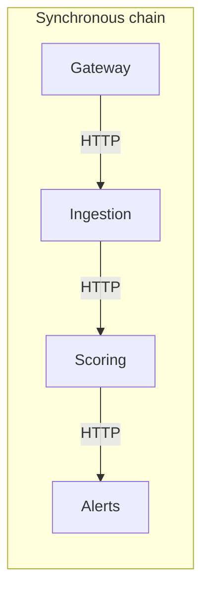
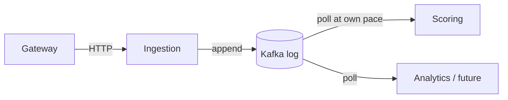
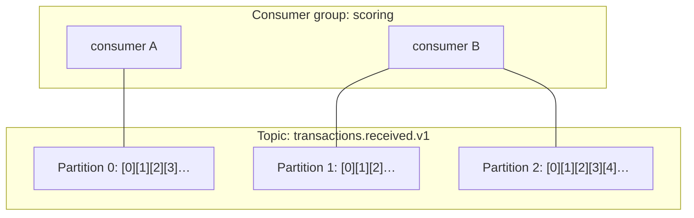

# 01 · Event-driven decoupling with Kafka

> **Status:** ✅ Producer side implemented in [Feature 001](../../specs/001-transaction-ingestion/spec.md) · consumer side in [Feature 003](../../specs/003-rule-based-scoring/spec.md)
> **Code:** [`KafkaTransactionPublisher`](../../ingestion-service/src/main/java/com/fraudplatform/ingestion/infrastructure/kafka/KafkaTransactionPublisher.java), [`application.yml`](../../ingestion-service/src/main/resources/application.yml), [`TransactionIngestionIT`](../../ingestion-service/src/test/java/com/fraudplatform/ingestion/TransactionIngestionIT.java)

## TL;DR
Producers write facts ("transaction received") to a durable, partitioned log. Consumers read at their own pace. Neither knows the other exists, so they **scale, fail and deploy independently**.

## The problem it solves

In a synchronous chain, latency adds up (Σ of every hop), availability multiplies (0.999³ ≈ 0.997), and a traffic spike hits every service at once.

With a log in the middle, ingestion latency is just its own work plus the broker ack. Scoring can be down for an hour and catch up afterwards, and a new consumer can be added without touching producers.

## How Kafka works (the parts interviewers ask about)

| Concept | One-liner |
|---------|-----------|
| **Topic** | A named, append-only log split into partitions |
| **Partition** | The unit of ordering *and* parallelism. Order is guaranteed only **within** a partition. |
| **Key** | `hash(key) % partitions` picks the partition. We use **accountId**, so one account's events stay in order. |
| **Offset** | Position of a record in a partition. Consumers commit offsets to remember progress. |
| **Consumer group** | Partitions are divided among the group's members. Max useful parallelism = partition count. |
| **Replication** | Each partition has a leader and followers. The ISR is the set of in-sync replicas. |
| **Retention** | Records stay for a configured time or size whether or not they were consumed, so they can be replayed. |

## Delivery semantics

| Setting | Effect |
|---------|--------|
| `acks=0` | Fire and forget. Fast, can lose data. |
| `acks=1` | Leader wrote it. Lost if the leader dies before followers copy it. |
| **`acks=all`** + `min.insync.replicas=2` | All ISR members have it. Survives a broker failure. **We use this.** |
| **`enable.idempotence=true`** | The broker dedupes retries using the producer ID + sequence number, so a producer retry can't create a duplicate. |
| Consumer commits **after** processing | At-least-once. Combine with idempotent processing for effectively exactly-once ([concept 12](12-idempotency-and-exactly-once.md)). |

## In this repo
1. `POST /api/v1/transactions` → validate → `KafkaTransactionPublisher.publish()`
2. Record key = `accountId`. Headers `event-type`, `schema-version`. Value = JSON contract from `common`.
3. The request thread **blocks on the broker ack** (`future.get(timeout)`). It's a virtual thread, so that is cheap ([concept 07](07-virtual-threads.md)).
4. No ack within 5 s → `503 + Retry-After`. The client never gets `202` for something that isn't durable.
5. `TransactionIngestionIT` proves against a real broker that 10 events for one account land on one partition in order.

## Pitfalls
- **Hot partitions:** one huge merchant as a key overloads one partition. Pick keys with high cardinality and even distribution.
- **Changing the partition count** remaps keys, which breaks per-key ordering during the transition. Over-provision partitions up front.
- **Dual writes** (DB + Kafka) without an outbox can diverge. See [concept 13](13-resilience-patterns.md).
- **Large messages:** Kafka is tuned for small (< 1 MB) records. Use the claim-check pattern for blobs.
- **Leaking Java type headers** (`__TypeId__`) couples consumers to producer class names. We send plain JSON.

## Interview questions

How do you guarantee ordering for a customer's events?

Use the customer/account ID as the record key, so all its events go to one partition, and a partition is consumed by exactly one consumer in the group. With `enable.idempotence=true`, ordering is preserved even with retries (up to 5 in-flight requests).

What happens if a consumer crashes mid-batch?

Offsets weren't committed for the unprocessed records, so after a rebalance another consumer re-reads from the last committed offset. Some records get processed twice. That's at-least-once, which is why handlers must be idempotent.

How many consumers can you usefully run?

Up to the number of partitions. Extra consumers sit idle. Partitions are therefore the ceiling on parallelism and should be sized for peak load and future growth.

Kafka vs RabbitMQ?

Kafka is a replayable, partitioned log with high throughput and per-key ordering, where consumers track their own position. RabbitMQ is a smart broker with routing, per-message acks and priorities, and messages are gone once acked. Use Kafka for event streams and replay, RabbitMQ for task queues with complex routing.

Why did you return 202 instead of 201?

202 means "accepted for processing". The fraud decision happens asynchronously. 201 would imply a resource was created and is available, and nothing is queryable yet.

