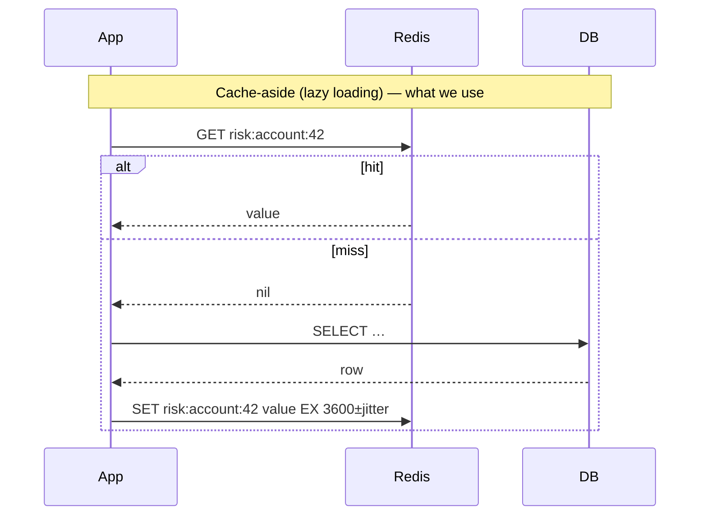

# 02 · Distributed caching with Redis

> **Status:** 📝 Planned: [Feature 005](../../specs/005-high-risk-account-cache/spec.md) (risk cache), [Feature 003](../../specs/003-rule-based-scoring/spec.md) (velocity windows)

## TL;DR
An in-process cache is fast but private to one JVM, so N instances have N inconsistent copies. A **distributed cache** (Redis) is shared. Its cost is one network hop (~0.2–1 ms), but every instance sees the same "account X is high-risk" flag the moment it's set.

## Caching patterns

| Pattern | Write path | Pros | Cons |
|---------|-----------|------|------|
| **Cache-aside** | App writes the DB, then **invalidates** the cache | Simple, resilient (cache down = slower, not broken) | First read misses. Race window on concurrent write+read. |
| Read-through | Cache library loads on miss | App code simpler | Cache becomes a hard dependency |
| Write-through | Write goes to cache **and** DB synchronously | Cache always warm | Write latency, caches unread data |
| Write-behind | Write to cache, DB flushed async | Fast writes | Risk of data loss |

**Invalidate, don't update**, on writes. Updating the cache from two concurrent writers can leave a stale value in it permanently. Deleting is idempotent.

## The three cache failure modes

| Failure | What happens | Mitigation (Feature 005) |
|---------|--------------|--------------------------|
| **Stampede / dogpile** | A hot key expires and 1,000 requests miss at once, all hitting the DB | Single-flight: only one loader per key (`SET lock NX`), the others wait or serve stale |
| **Avalanche** | Many keys share the same TTL and expire together | **TTL jitter** (±10%) |
| **Penetration** | Requests for keys that don't exist always miss | Cache negative results briefly, or use a Bloom filter |

## Redis data structures we use

| Use | Structure | Why |
|-----|-----------|-----|
| High-risk account | Hash | Several fields, partial reads |
| Velocity window | **Sorted set**, score = timestamp | `ZREMRANGEBYSCORE` drops old entries, `ZCARD` counts the window, both in one Lua call |
| Rate limiter | Hash + Lua | Atomic read-modify-write ([concept 06](06-distributed-rate-limiting.md)) |
| Distributed lock | String + `NX PX` | [concept 05](05-two-layer-concurrent-write-protection.md) |
| Idempotency | String + `NX EX` | First writer wins |

## Pitfalls
- `KEYS *` in production blocks the single-threaded server. Use `SCAN`.
- Big values or huge collections block the server too. Keep values small.
- Set `maxmemory` + an eviction policy (`allkeys-lru`), or Redis will OOM.
- Serialisation: prefer a stable format (JSON) over JDK serialisation (brittle, unsafe).
- Treat the cache as **disposable**. The system must be correct with an empty cache.

## Interview questions

How do you keep cache and DB consistent?

Write the DB first, then delete the cache key. The remaining race (a reader loads the old value just before the delete and writes it back afterwards) is mitigated by a short TTL, delayed double-delete, or CDC-driven invalidation (Debezium → Kafka → evict). Strong consistency would require not caching that data.

Why is Redis single-threaded and still fast?

Commands execute on one thread over in-memory data, with no locks and no context switches. The bottleneck is network I/O, which uses multiplexing (epoll), and Redis 6+ has threaded I/O. One slow command (`KEYS`, a big `SMEMBERS`) blocks everyone.

Local cache vs distributed cache?

Local (Caffeine) is nanoseconds, but each instance has its own copy and invalidation is hard. Distributed (Redis) is sub-millisecond, shared and consistent. Often you use both: L1 Caffeine with a short TTL in front of L2 Redis.

