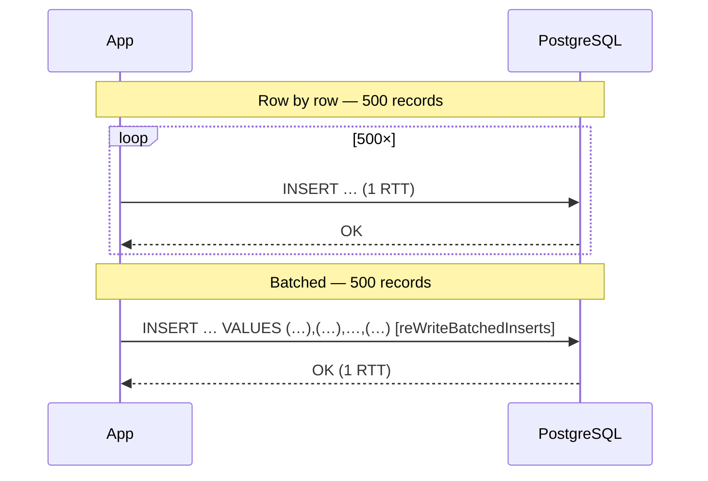

# 04 · JDBC batch processing

> **Status:** ✅ Implemented in [Feature 004](../../specs/004-persistence-jdbc-batch/spec.md)
> **Code:** [`JdbcAssessmentRepository`](../../scoring-service/src/main/java/com/fraudplatform/scoring/infrastructure/persistence/JdbcAssessmentRepository.java), [`TransactionReceivedListener`](../../scoring-service/src/main/java/com/fraudplatform/scoring/api/TransactionReceivedListener.java) (batch listener), [`BatchInsertBenchmarkIT`](../../scoring-service/src/test/java/com/fraudplatform/scoring/infrastructure/persistence/BatchInsertBenchmarkIT.java), [`V1__scoring_schema.sql`](../../scoring-service/src/main/resources/db/migration/V1__scoring_schema.sql)

## TL;DR
Send many statements in **one network round-trip** and commit them in **one transaction**. Round trips and commit fsyncs, not SQL execution, dominate insert cost.



## Measured in this repo
`BatchInsertBenchmarkIT` inserts 5,000 rows into PostgreSQL 17 (Testcontainers, laptop):

| Strategy | Elapsed | Rows/sec | Why |
|----------|--------:|---------:|-----|
| Row-by-row, autocommit | 733 ms | ~6,800 | 5,000 round trips **and** 5,000 commits (WAL fsync each) |
| Row-by-row, one transaction | 474 ms | ~10,500 | 5,000 round trips, 1 commit |
| `batchUpdate` + `reWriteBatchedInserts` | **14 ms** | **~357,000** | ~10 multi-row statements, 1 commit |

The two row-by-row lines show that removing per-row commits helps about 1.5×. Removing per-row round trips helps another **~35×**. Numbers vary by machine, so the test only asserts that batching is at least 3× faster.

## How we do it
```java
jdbcTemplate.batchUpdate("""
        INSERT INTO transaction (id, transaction_id, account_id, amount, …)
        VALUES (?, ?, ?, ?, …)
        ON CONFLICT (transaction_id) DO NOTHING
        """,
        records, 500,                       // batch size
        (ps, r) -> { ps.setObject(1, r.id()); … });
```
- `reWriteBatchedInserts=true` on the PostgreSQL JDBC URL makes the driver rewrite N single-row inserts into multi-row `VALUES` statements.
- **One DB transaction per Kafka poll**, and offsets are committed **after** the DB commit. A crash means a replay, and `ON CONFLICT DO NOTHING` makes the replay harmless.
- Batch size: 100–1,000 is the sweet spot. Bigger batches use more memory and hold longer locks for diminishing returns.

## JPA/Hibernate batching (and why we use plain JDBC on the hot path)
Hibernate can batch (`hibernate.jdbc.batch_size=50`, `order_inserts=true`), but:
- `GenerationType.IDENTITY` **disables insert batching**, because Hibernate needs each generated ID immediately. Use `SEQUENCE` with a pooled optimizer, or app-generated UUIDv7.
- The persistence context holds every entity. Call `flush()` + `clear()` every N rows or memory grows.
- For write-only, high-volume paths, `JdbcTemplate.batchUpdate` is simpler and faster.

## Batch listener + poison pills
The Kafka listener receives a whole `poll()` as `List<String>`, so persistence can batch it. If record *i* is malformed, the listener scores records `0..i-1` and throws `BatchListenerFailedException(i)`. Spring commits offsets before *i*, sends *i* to the DLT, and redelivers the rest. One bad record never blocks or loses the batch.

## UUIDv7 vs UUIDv4 primary keys
UUIDv4 is random, so each insert lands on a random B-tree page, which causes page splits, a cold cache and index bloat. UUIDv7 is time-ordered, so inserts append to the right edge like a sequence, while staying globally unique with no DB round trip.

This repo goes one step further with [`UuidV7.fromTimeAndName`](../../scoring-service/src/main/java/com/fraudplatform/scoring/infrastructure/persistence/UuidV7.java): timestamp = `occurredAt`, random bits = SHA-256(`transactionId`). The key is **time-ordered and deterministic**. A redelivered transaction produces the same PK, so all three batched inserts can be plain `VALUES … ON CONFLICT DO NOTHING`, with no `INSERT … SELECT` lookups to resolve foreign keys.

## Alternatives for bulk loads
| Tool | Throughput | Use |
|------|-----------|-----|
| `batchUpdate` | Good | Streaming inserts (our case) |
| `COPY … FROM STDIN` (`CopyManager`) | Best | Bulk import / backfill |
| Multi-row `INSERT … SELECT unnest(?::uuid[], …)` | Very good | Arrays in one statement |

## Interview questions
<details><summary>Your batch has 500 rows and row 237 violates a constraint. What happens?</summary>

By default the whole batch fails (`BatchUpdateException`) and the transaction is rolled back. Options: make the conflict a non-error (`ON CONFLICT DO NOTHING`), validate beforehand, or fall back to row-by-row for the failed batch and dead-letter the bad row.
</details>

<details><summary>How did you pick the batch size?</summary>

Measure it. Throughput rises steeply up to ~100, flattens by ~500–1,000, and larger batches mostly add memory and lock duration. The benchmark IT in Feature 004 records the curve.
</details>
