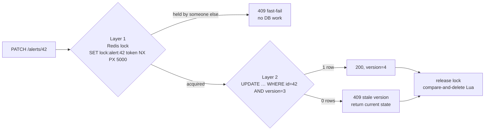

# 05 · Two-layer concurrent-write protection

> **Status:** 📝 Planned: [Feature 007](../../specs/007-alert-management/spec.md)

## The problem: lost updates
```
Analyst A reads alert 42 (OPEN, v3)        Analyst B reads alert 42 (OPEN, v3)
A sets CONFIRMED_FRAUD, saves               B sets FALSE_POSITIVE, saves  ← silently overwrites A
```
The account is unblocked even though it is fraudulent. With N instances behind a load balancer, `synchronized` or a JVM lock can't help, because A and B may be on different JVMs.

## The two layers



| Layer | Mechanism | Role | Fails when |
|-------|-----------|------|------------|
| 1 · Distributed lock | Redis `SET key token NX PX ttl` | **Efficiency:** serialises contenders across instances cheaply and avoids wasted DB work | Lock TTL expires during a GC pause or network partition, so two holders exist |
| 2 · Optimistic locking | JPA `@Version` → `WHERE version = ?` | **Correctness:** the DB is the single source of truth | Never silently: 0 rows updated → `OptimisticLockException` |

**Why not only layer 2?** It is correct on its own, but under contention every loser does a full read + validate + failed write. Layer 1 rejects them in about a millisecond.
**Why not only layer 1?** Redis locks are leases, not real mutual exclusion (see Kleppmann's *"How to do distributed locking"*). A paused holder can wake after expiry and write. Layer 2 acts as the **fencing token**.

## Implementation notes
```lua
-- unlock.lua: only delete if we still own it (never release someone else's lock)
if redis.call("GET", KEYS[1]) == ARGV[1] then
  return redis.call("DEL", KEYS[1])
else
  return 0
end
```
```java
@Entity class Alert {
    @Version private long version;   // Hibernate adds "AND version = ?" and increments it
}
```
- The token is a random UUID per acquisition.
- Lock TTL > p99 of the critical section. Keep critical sections short (no remote calls inside).
- The client sends `version` (or an `If-Match` ETag header), which gives HTTP-level optimistic concurrency.

## Optimistic vs pessimistic locking

| | Optimistic (`@Version`) | Pessimistic (`SELECT … FOR UPDATE`) |
|-|------------------------|-------------------------------------|
| Blocks? | No, conflicts detected at commit | Yes, others wait for the row lock |
| Best for | Low contention, user think-time between read and write | High contention, short transactions |
| Risk | Retry storms under contention | Deadlocks, lock waits, connection hogging |
| Spans HTTP requests? | ✅ (version travels with the client) | ❌ (lock dies with the transaction) |

## Proving it (AC-007-07)
```java
CountDownLatch start = new CountDownLatch(1);
try (var pool = Executors.newVirtualThreadPerTaskExecutor()) {
    List<Future<Integer>> results = IntStream.range(0, 50)
        .mapToObj(i -> pool.submit(() -> { start.await(); return patch(alertId, version); }))
        .toList();
    start.countDown();                                  // release all 50 at once
    assertThat(statuses(results)).containsOnlyOnce(200); // 49 × 409
}
```

## Interview questions
<details><summary>Is a Redis lock safe for correctness?</summary>

Not on its own. TTL-based leases can expire while the holder still thinks it owns the lock (GC pause, clock jump). Pair it with a fencing token that the storage layer checks. Here, that's the version column.
</details>

<details><summary>Redlock?</summary>

Redlock acquires the lock on a majority of N independent Redis nodes. It improves availability, but it still relies on timing assumptions. For correctness, rely on fencing at the resource. For efficiency, a single Redis lock is enough.
</details>

<details><summary>What about database isolation levels?</summary>

Under READ COMMITTED (Postgres default), lost updates are possible without locking. REPEATABLE READ in Postgres detects the concurrent update and aborts with a serialization error. SERIALIZABLE prevents all anomalies at the cost of retries. Optimistic versioning works at any level and across requests.
</details>
