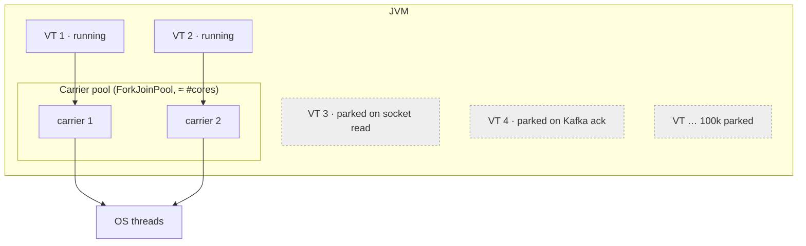

# 07 · JDK 21 virtual threads

> **Status:** ✅ Enabled in [Feature 001](../../specs/001-transaction-ingestion/spec.md) (`spring.threads.virtual.enabled=true`) · ✅ measured and used for parallel scoring in [Feature 009](../../specs/009-concurrency-deep-dive/spec.md)
> **Lab:** [`VirtualVersusPlatformThreadsTest`](../../concurrency-lab/src/test/java/com/fraudplatform/lab/VirtualVersusPlatformThreadsTest.java), [`PinningTest`](../../concurrency-lab/src/test/java/com/fraudplatform/lab/PinningTest.java), [`ParallelScoringTest`](../../scoring-service/src/test/java/com/fraudplatform/scoring/application/ParallelScoringTest.java)
> **Code:** [`application.yml`](../../ingestion-service/src/main/resources/application.yml), [`KafkaTransactionPublisher`](../../ingestion-service/src/main/java/com/fraudplatform/ingestion/infrastructure/kafka/KafkaTransactionPublisher.java) (blocking `future.get`)

## TL;DR
A virtual thread is a `java.lang.Thread` scheduled by the JVM, not the OS. When it blocks on I/O, the JVM **unmounts** it from its carrier (platform) thread and parks its stack on the heap. You can have **millions** of them, so you write simple blocking code and get async-level scalability for I/O-bound work.



| | Platform thread | Virtual thread |
|-|-----------------|----------------|
| Backed by | One OS thread each | Mounted on a few carrier threads |
| Stack | ~1 MB reserved | Grows on the heap, ~few hundred bytes to KBs |
| Creation cost | ~µs + syscall | ~ns, pure Java object |
| Practical max | thousands | millions |
| Blocking I/O | Wastes an OS thread | Unmounts, the carrier runs another VT |
| Pool it? | Yes | **Never.** Create one per task. |

## Measured in this repo
| Experiment | Platform threads | Virtual threads |
|------------|-----------------:|----------------:|
| 10,000 tasks × `sleep(100 ms)`, fixed pool of 200 vs thread-per-task | **5,196 ms** (50 waves) | **150 ms** |
| 20 tasks blocking 100 ms, 2 carriers: inside `synchronized` | n/a | **1,033 ms**, 18 × `jdk.VirtualThreadPinned` |
| …same with `ReentrantLock` | n/a | **102 ms**, 0 pinned |
| Scoring a 60-record poll over 20 accounts at 20 ms per Redis call: sequential vs parallel accounts | 1,444 ms | **76 ms** |

## Parallel scoring without breaking order
`ScoreTransactionService` groups a poll by account, runs each account on its own virtual thread (at most 64 at a time, guarded by a `Semaphore`), and processes one account's records **in order**. That's the same contract Kafka partitions give across consumers, applied inside a batch. Velocity windows and in-batch "declined → flagged" propagation stay correct, while the Redis latency of different accounts overlaps.

## Why it matters here
The ingestion request does: validate (µs) → **wait for the Kafka ack (ms)** → respond. With Tomcat's 200 platform threads, the 201st concurrent request waits in the queue even though the CPU is idle. With virtual threads, every request gets its own thread, and waiting costs almost nothing.

So `KafkaTransactionPublisher` simply does `template.send(record).get(timeout)`. No `CompletableFuture` chains, no reactive operators, and stack traces still make sense.

## When they don't help
- **CPU-bound work** (ML inference, crypto): you still have only #cores carriers. Use a bounded platform pool.
- **Limited downstream resources:** 10,000 virtual threads still share a 20-connection Hikari pool. Bound concurrency with a **`Semaphore`** ([concept 08](08-concurrency-primitives.md)). Virtual threads remove the *thread* limit, not the *resource* limit.

## Pinning (JDK 21–23)
A virtual thread is **pinned** to its carrier, and blocking then blocks the carrier too, when it blocks:
1. inside a `synchronized` block or method, or
2. in a native method or foreign function.

```java
synchronized (lock) { socket.read(); }        // ❌ pins the carrier on JDK 21
lock.lock(); try { socket.read(); } finally { lock.unlock(); }   // ✅ ReentrantLock unmounts
```
Detect it with `-Djdk.tracePinnedThreads=full` (JDK 21) or the JFR event `jdk.VirtualThreadPinned`. **JDK 24 (JEP 491)** fixes `synchronized` pinning.

## `ScopedValue` vs `ThreadLocal`
| | `ThreadLocal` | `ScopedValue` (preview in 21, final in JDK 25) |
|-|---------------|------------------------------------------------|
| Mutability | `set()` anywhere, anytime | Immutable binding for a bounded scope: `ScopedValue.where(USER, u).run(...)` |
| Lifetime | Until `remove()`, which leaks easily in pools | Ends with the scope, automatically |
| Inheritance by child threads | Copies (`InheritableThreadLocal`), costly with millions of threads | Shared cheaply with `StructuredTaskScope` subtasks |
| Good for | Legacy frameworks (MDC, transactions) | Request context (user, trace id) on virtual threads |

This repo stays on JDK 21 without preview flags, so request context still flows through Spring's ThreadLocal-based mechanisms. These are safe with virtual threads because each request has its own thread, which is never pooled or reused.

## Other gotchas
- **ThreadLocal:** works, but a million threads × a heavy ThreadLocal means a lot of memory. Prefer `ScopedValue` (preview in 21, final in JDK 25) for request context.
- **Don't pool them:** `Executors.newVirtualThreadPerTaskExecutor()` creates a new thread per task by design.
- **Thread dumps:** `jcmd <pid> Thread.dump_to_file -format=json` shows virtual threads. Classic `jstack` doesn't show all of them.

## Interview questions
<details><summary>Virtual threads vs reactive (WebFlux)?</summary>

Both achieve high concurrency for I/O-bound work. Reactive does it with non-blocking callbacks, which means a steep learning curve, hard debugging, and "colored" functions. Virtual threads keep blocking, imperative code. Reactive still wins for streaming and backpressure semantics. For request/response services, virtual threads are now the simpler default.
</details>

<details><summary>Does a virtual thread make my code faster?</summary>

No. Each request is not faster, and throughput only rises when threads were the bottleneck (lots of blocking). CPU-bound code gains nothing.
</details>

<details><summary>What is a carrier thread?</summary>

A platform thread in a dedicated ForkJoinPool (size ≈ cores) that executes virtual threads. A VT is mounted on a carrier while running and unmounted when it parks.
</details>
