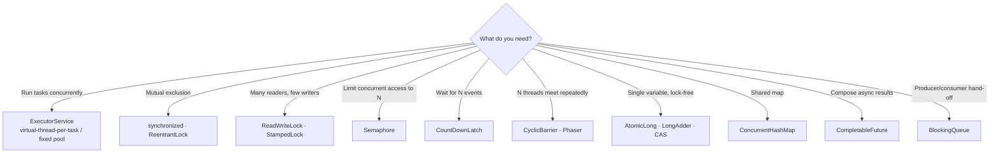

# 08 · Concurrency primitives: threads, semaphores, locks & friends

> **Status:** ✅ Semaphore bulkhead in [Feature 006](../../specs/006-ml-assisted-scoring/spec.md) ([`SemaphoreBulkheadMlScorer`](../../scoring-service/src/main/java/com/fraudplatform/scoring/infrastructure/ml/SemaphoreBulkheadMlScorer.java), test: 100 callers / 4 permits → high-water mark ≤ 4) · ✅ `ConcurrentHashMap` + `CompletableFuture` single-flight in [Feature 005](../../specs/005-high-risk-account-cache/spec.md) · 📝 full catalogue in [Feature 009](../../specs/009-concurrency-deep-dive/spec.md)

## Map of the toolbox



## Primitive by primitive (and where this repo uses it)

### `Semaphore`: bulkhead
Limits **how many** threads are inside a section at once, which makes it a perfect fit with virtual threads.
```java
private final Semaphore permits = new Semaphore(32);         // ML model: 32 concurrent inferences

double score(Features f) {
    if (!permits.tryAcquire(20, TimeUnit.MILLISECONDS)) {     // don't queue forever
        fallbackCounter.increment();
        return RULES_ONLY;                                     // degrade gracefully
    }
    try { return model.predict(f); }
    finally { permits.release(); }                             // ALWAYS in finally
}
```
*Used in:* ML scorer (006), and DB-bound fan-out (009).

### `ReentrantLock` vs `synchronized`
| | `synchronized` | `ReentrantLock` |
|-|----------------|-----------------|
| Syntax | Block-scoped, auto-release | Must `unlock()` in `finally` |
| `tryLock(timeout)` | ❌ | ✅ |
| Interruptible wait | ❌ | `lockInterruptibly()` |
| Fairness option | ❌ | ✅ |
| Multiple conditions | One (`wait/notify`) | Many `Condition`s |
| Virtual-thread pinning (JDK 21) | ⚠️ pins | ✅ doesn't |

### `ReadWriteLock`: model hot-swap
Many scoring threads **read** the model, and a rare reload **writes** it. Readers proceed in parallel, and the writer gets exclusive access. (An `AtomicReference<Model>` swap is often even simpler. Feature 009 compares the two.)

### Atomics & `LongAdder`
`AtomicLong.incrementAndGet()` is a CAS loop, lock-free but contended under heavy writes. `LongAdder` stripes the counter across cells, which makes it much faster for hot counters you read rarely (metrics).

### `ConcurrentHashMap.computeIfAbsent`: per-key locks
```java
ConcurrentMap<String, ReentrantLock> locks = new ConcurrentHashMap<>();
locks.computeIfAbsent(accountId, k -> new ReentrantLock()).lock();
```
This serialises work per account while different accounts proceed in parallel. In this design Kafka partitioning already gives per-account serialisation **across** the cluster, a nice interview point.

### `CountDownLatch`: start gates in tests
Used in the concurrency tests to release 50 threads at the same instant, which maximises contention (AC-007-07).

### `CompletableFuture`: fan-out / fan-in
```java
var futures = rules.stream()
    .map(r -> CompletableFuture.supplyAsync(() -> r.evaluate(tx), virtualThreads)
                               .completeOnTimeout(RuleResult.timeout(r), 50, MILLISECONDS))
    .toList();
CompletableFuture.allOf(futures.toArray(CompletableFuture[]::new)).join();
```
Wall time ≈ the slowest rule, not the sum (AC-009-01).

### `BlockingQueue`: producer/consumer
`ArrayBlockingQueue` (bounded) gives natural **backpressure**: producers block when it's full. An unbounded `LinkedBlockingQueue` hides overload until OOM.

## Classic hazards

| Hazard | Example | Prevention |
|--------|---------|-----------|
| **Race condition** | `count++` from two threads | Atomics, locks, confinement |
| **Deadlock** | T1 holds A, wants B. T2 holds B, wants A. | Global lock ordering, `tryLock` with timeout |
| **Livelock** | Both back off and retry in lockstep | Randomised backoff |
| **Starvation** | Unfair lock and a greedy thread | Fair locks, bounded critical sections |
| **Visibility** | A flag written by T1 never seen by T2 | `volatile`, or any happens-before edge |
| **Thread-pool exhaustion** | Blocking tasks in a small pool | Virtual threads, or separate pools per workload |

## Java Memory Model in one paragraph
Without a **happens-before** edge, one thread's writes may never become visible to another (CPU caches, reordering). Edges come from: unlock → subsequent lock of the same monitor, `volatile` write → read, `Thread.start()`, `Thread.join()`, and the completion actions of concurrent collections and futures. `volatile` gives visibility and ordering, but **not atomicity** (`volatile int x; x++` is still a race).

## Interview questions
<details><summary>Semaphore vs a fixed thread pool for limiting concurrency?</summary>

A fixed pool limits concurrency by limiting threads, which ties the limit to thread count and queues work. A semaphore limits access to a resource independently of threads. With virtual threads you spawn freely and guard only the scarce resource. It also allows `tryAcquire` with a timeout, for fail-fast and fallback.
</details>

<details><summary>How would you find a deadlock in production?</summary>

Take a thread dump (`jcmd <pid> Thread.print` or JFR). The JVM reports "Found one Java-level deadlock" with the lock cycle. `ThreadMXBean.findDeadlockedThreads()` can do this programmatically for a health check.
</details>

<details><summary>Why is double-checked locking broken without volatile?</summary>

Object construction can be reordered with publishing the reference, so another thread may see a non-null reference to a partially constructed object. `volatile` on the field forbids that reordering.
</details>
