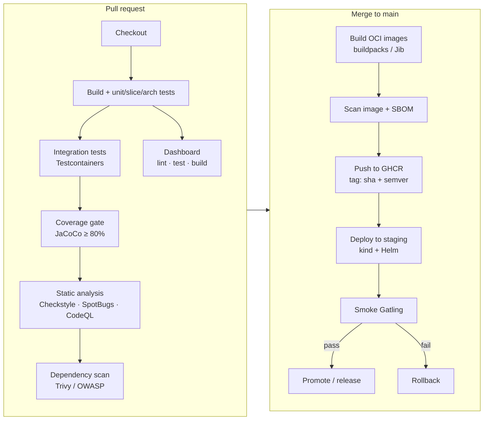

# 10 · CI/CD pipeline

> **Status:** ✅ Implemented in [Feature 014](../../specs/014-ci-cd/spec.md)
> **Workflows:** [`ci.yml`](../../.github/workflows/ci.yml) · [`security.yml`](../../.github/workflows/security.yml) · [`delivery.yml`](../../.github/workflows/delivery.yml) · [`load-smoke.yml`](../../.github/workflows/load-smoke.yml) · [`release.yml`](../../.github/workflows/release.yml) · manifests in [`k8s/`](../../k8s)

## Target pipeline

## Principles
- **Fast feedback first:** cheap checks (compile, unit tests) run before expensive ones (containers).
- **The build is the gate:** coverage, architecture rules and SLO assertions fail the pipeline. Humans review design, not formatting.
- **Build once, promote the same artifact:** the image digest tested in staging is the one deployed to production.
- **Reproducible:** Maven wrapper, pinned action versions, dependency caching keyed on `pom.xml`.
- **Shift-left security:** dependency, secret and image scanning on every PR.

## What this repo's pipeline does
| Stage | Where | Fails the change when… |
|-------|-------|------------------------|
| Unit · slice · ArchUnit · Error Prone · Checkstyle · JaCoCo | `ci.yml` / unit | a test fails, a layer rule is broken, a compile-time bug pattern is found, coverage < 80% (domain/application) |
| Integration (Testcontainers: Kafka, PostgreSQL, Redis) | `ci.yml` / integration | real-infrastructure behaviour regresses |
| Dashboard | `ci.yml` / dashboard | format, lint, types, tests or build fail |
| Config lint | `ci.yml` / config-lint | Prometheus rules, Kustomize or compose are invalid |
| CodeQL · Trivy (deps) · gitleaks | `security.yml` | a code-scanning finding, a fixable HIGH/CRITICAL CVE, or a committed secret |
| Images · Trivy (image) · SBOM · **kind deploy · smoke · rollback** | `delivery.yml` | the platform doesn't come up healthy in Kubernetes or can't turn a transaction into an alert |
| Full stack + Gatling SLOs | `load-smoke.yml` (nightly) | p95 or success-rate SLOs are missed |

Lessons that shaped it:
- **Shared runners share IPs**, so Docker Hub's anonymous pull limit stalled Testcontainers for 7 minutes per test class. All pulls now go through a public mirror: Testcontainers via `TESTCONTAINERS_HUB_IMAGE_NAME_PREFIX`, and the Docker daemon via `registry-mirrors`.
- **Path filters and required checks don't mix** unless one aggregating job (`CI passed`) turns "skipped" into "fine".
- **Deploy on PRs, not only after merge.** The kind job costs ~10 minutes and catches broken manifests and images before they reach `main`.
- A local **kind rehearsal** of the delivery job caught two bugs before CI ever ran:
  1. `runAsNonRoot: true` + `USER app` → `CreateContainerConfigError`. Kubernetes can only verify a **numeric** UID is not root, so the image now uses `USER 10001`.
  2. Pods crash-looped with `REDIS_PORT=tcp://10.96…:6379`. Kubernetes injects Docker-link-style variables for every Service (`<SERVICE>_PORT`), which collided with the app's own `REDIS_PORT`. The fix is `enableServiceLinks: false`, which also stops leaking every Service address into every pod.

## Deployment strategies

| Strategy | How | Trade-off |
|----------|-----|-----------|
| Rolling | Replace pods gradually | Default. Mixed versions during the rollout. |
| Blue/green | Two full environments, switch the router | Instant rollback, 2× capacity |
| Canary | Send 5% of traffic to the new version, watch metrics, widen | Safest. Needs good observability. |
| Feature flags | Deploy dark, release by toggle | Decouples deploy from release |

## Interview questions

How do you deploy a breaking Kafka schema change with zero downtime?

Expand/contract. Add fields compatibly (consumers ignore unknown fields), deploy consumers that understand both, then producers. For truly breaking changes, publish to `.v2` in parallel, migrate consumers, and retire `.v1`.

How do you deploy a DB migration safely?

Backward-compatible migrations first (add a nullable column), deploy the app that writes both, backfill, deploy the app that reads the new column, then drop the old one in a later release. Never rename in place.

