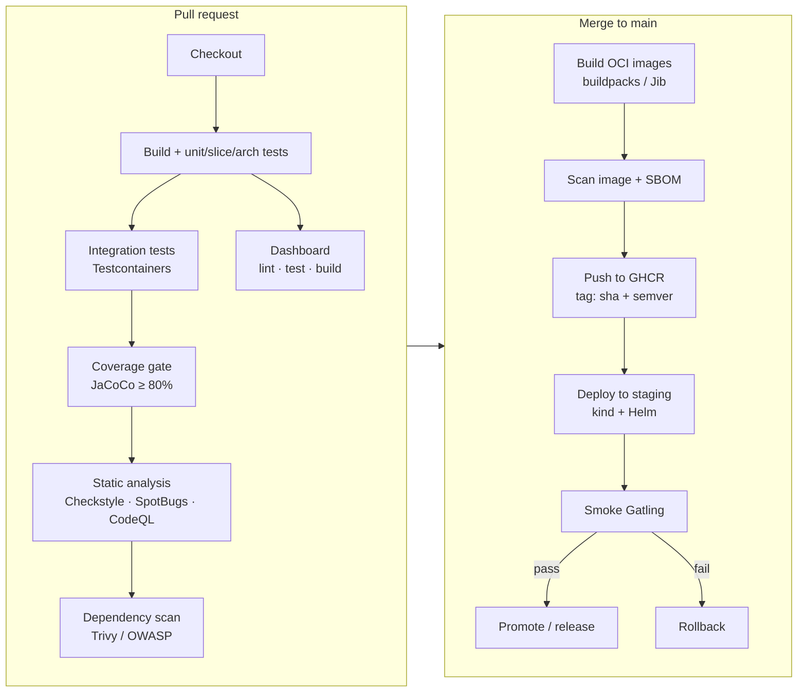

# 10 · CI/CD pipeline

> **Status:** ✅ Basic CI in [Feature 000](../../specs/000-foundation/spec.md) ([`ci.yml`](../../.github/workflows/ci.yml)) · full pipeline in [Feature 014](../../specs/014-ci-cd/spec.md)

## Target pipeline

## Principles
- **Fast feedback first:** cheap checks (compile, unit tests) run before expensive ones (containers).
- **The build is the gate:** coverage, architecture rules and SLO assertions fail the pipeline. Humans review design, not formatting.
- **Build once, promote the same artifact:** the image digest tested in staging is the one deployed to production.
- **Reproducible:** Maven wrapper, pinned action versions, dependency caching keyed on `pom.xml`.
- **Shift-left security:** dependency, secret and image scanning on every PR.

## Deployment strategies

| Strategy | How | Trade-off |
|----------|-----|-----------|
| Rolling | Replace pods gradually | Default. Mixed versions during the rollout. |
| Blue/green | Two full environments, switch the router | Instant rollback, 2× capacity |
| Canary | Send 5% of traffic to the new version, watch metrics, widen | Safest. Needs good observability. |
| Feature flags | Deploy dark, release by toggle | Decouples deploy from release |

## Interview questions

How do you deploy a breaking Kafka schema change with zero downtime?

Expand/contract. Add fields compatibly (consumers ignore unknown fields), deploy consumers that understand both, then producers. For truly breaking changes, publish to `.v2` in parallel, migrate consumers, and retire `.v1`.

How do you deploy a DB migration safely?

Backward-compatible migrations first (add a nullable column), deploy the app that writes both, backfill, deploy the app that reads the new column, then drop the old one in a later release. Never rename in place.

