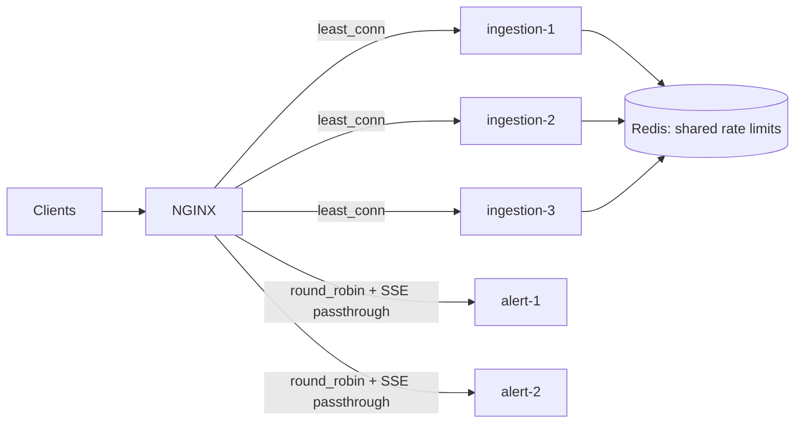

# 11 · Load balancing

> **Status:** ✅ Implemented in [Feature 011](../../specs/011-load-balancing/spec.md)
> **Code:** [`nginx.conf`](../../infra/nginx/nginx.conf), [`docker-compose.yml`](../../infra/docker-compose.yml) (`--profile app`), [`smoke-test.sh`](../../infra/smoke-test.sh), [`ConsumerGroupRebalanceIT`](../../scoring-service/src/test/java/com/fraudplatform/scoring/ConsumerGroupRebalanceIT.java), [`HealthProbesIT`](../../alert-service/src/test/java/com/fraudplatform/alerts/HealthProbesIT.java)

## L4 vs L7

| | L4 (transport) | L7 (application) |
|-|----------------|------------------|
| Sees | IP:port, TCP/UDP | HTTP method, path, headers, cookies |
| Can do | Fast forwarding, TLS passthrough | Path routing, header injection, retries, rate limits |
| Examples | AWS NLB, IPVS | NGINX, Envoy, AWS ALB |

## Algorithms

| Algorithm | Good for | Weakness |
|-----------|----------|----------|
| Round robin | Uniform, short requests | Ignores current load |
| **Least connections** | Varied request durations (our ingestion) | Needs connection tracking |
| Weighted | Heterogeneous instances | Manual weights |
| IP hash / sticky | Session affinity | Uneven spread, sticky to failed nodes |
| **Consistent hashing** | Caches/shards: adding a node remaps ~1/N of keys | More complex |
| Power of two choices | Large fleets: pick 2 at random, take the less loaded | Approximate |

## Our topology

## Measured
`infra/smoke-test.sh` boots 3 ingestion, 3 scoring and 2 alert instances behind NGINX, sends a velocity burst through the gateway and waits for the alert. The gateway log shows the 8 POSTs spread **3 / 3 / 2** across the ingestion replicas (`least_conn`).

`ConsumerGroupRebalanceIT`: 3 consumers on 12 partitions get **4 each**. One leaves, and the two survivors end with **6 each, still owning their original 4**. That's cooperative-sticky: only the orphaned partitions move, and nobody stops consuming during the rebalance.

## NGINX settings worth knowing
| Setting | Why |
|---------|-----|
| `least_conn` (ingestion) | Steers new requests away from an instance stuck waiting on Kafka acks |
| `server … resolve` + `zone` + `resolver 127.0.0.11` | Re-resolves Docker DNS, so scaled or restarted replicas join without a reload |
| `max_fails=3 fail_timeout=10s` | Passive health check: 3 failures take a replica out for 10 s |
| `proxy_next_upstream error timeout http_502 http_503 non_idempotent` | Retry on another replica, even for POST. Only safe because ingestion is idempotent. |
| `proxy_http_version 1.1` + `Connection ""` + `keepalive` | Reuse upstream connections (no TCP handshake per request) |
| SSE location: `proxy_buffering off`, `proxy_read_timeout 1h` | Events reach the browser immediately, and idle streams aren't cut |
| `X-Request-Id` map | Keep the client's id or mint one, forward it, return it, log it with `upstream=` |
| `limit_req` per IP | Coarse edge protection. Business quotas stay in the service, on Redis. |

## Two kinds of load balancing in this system
1. **HTTP traffic:** NGINX spreads requests across stateless instances. Statelessness is what makes this work, so all shared state (rate limits, idempotency, locks) lives in Redis.
2. **Kafka partitions:** the consumer group coordinator assigns partitions to scoring instances. It's a different mechanism with the same goal. Adding an instance triggers a **rebalance**. The cooperative-sticky assignor moves only the partitions it has to.

## Kafka groups split; SSE needs broadcast
Kafka consumer groups give each record to **one** alert-service instance. A browser's SSE connection, however, lands on an arbitrary instance. So the instance that ingested an alert re-broadcasts the change over **Redis pub/sub** ([`RedisAlertChangeBus`](../../alert-service/src/main/java/com/fraudplatform/alerts/infrastructure/redis/RedisAlertChangeBus.java)), and every instance pushes it to its own SSE clients. Pub/sub is fire-and-forget, which is fine here because the DB is the source of truth and clients refetch on reconnect.

Long-lived connections also affect **deploys**. Graceful shutdown waits for in-flight requests, and an SSE stream never finishes by itself. alert-service completes all streams on `ContextClosedEvent`, so shutdown doesn't hang for the whole grace period. Browsers reconnect, and the load balancer routes them to a healthy instance. This bug was caught in Feature 008: the test JVM took 30 s to exit.

## Health checks and draining
Readiness is not liveness. `HealthProbesIT` shows that when readiness goes `REFUSING_TRAFFIC`, `/actuator/health/readiness` returns **503** (the LB stops routing) while liveness stays **200** (don't restart it, it's draining). Spring Boot publishes exactly that event when graceful shutdown begins.

- **Liveness:** is the process alive? (restart if not)
- **Readiness:** should it get traffic? (remove from the LB if not)
- On SIGTERM: readiness goes `OUT_OF_SERVICE`, the LB stops routing, in-flight requests finish (`server.shutdown=graceful`), Kafka commits, then the process exits.

## Interview questions

Why must the rate limiter be distributed once you add a load balancer?

Each instance would enforce the limit independently, so the effective limit becomes limit × instances, and it changes with autoscaling. A shared counter (Redis) enforces the true global quota.

How do you load-balance long-lived connections (SSE/WebSockets)?

Least-connections at connect time. Disable proxy buffering and extend read timeouts. Clients reconnect with backoff (and `Last-Event-ID`) when a node goes away, and publish events through a shared bus (Redis pub/sub or Kafka) so any node can push to its connected clients.

