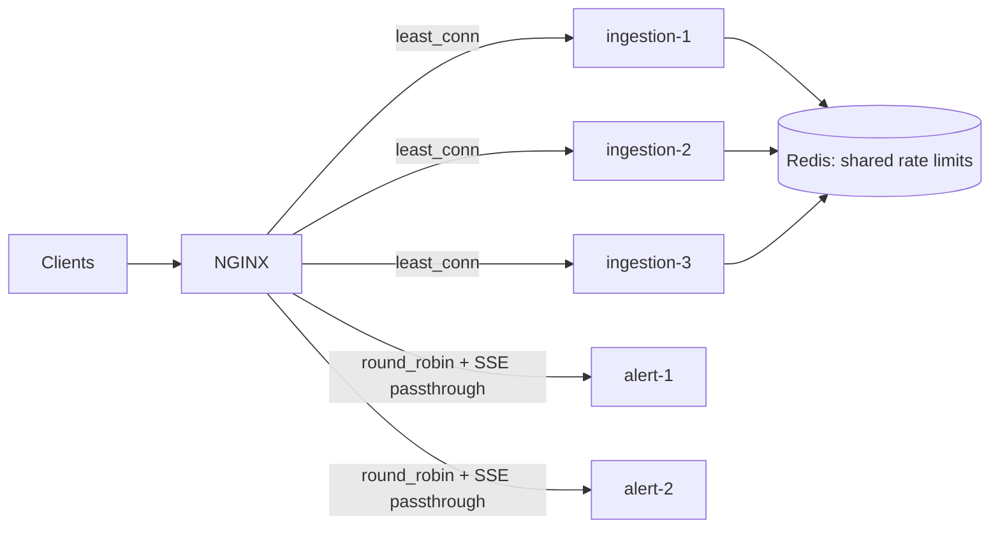

# 11 · Load balancing

> **Status:** 📝 Planned: [Feature 011](../../specs/011-load-balancing/spec.md)

## L4 vs L7

| | L4 (transport) | L7 (application) |
|-|----------------|------------------|
| Sees | IP:port, TCP/UDP | HTTP method, path, headers, cookies |
| Can do | Fast forwarding, TLS passthrough | Path routing, header injection, retries, rate limits |
| Examples | AWS NLB, IPVS | NGINX, Envoy, AWS ALB |

## Algorithms

| Algorithm | Good for | Weakness |
|-----------|----------|----------|
| Round robin | Uniform, short requests | Ignores current load |
| **Least connections** | Varied request durations (our ingestion) | Needs connection tracking |
| Weighted | Heterogeneous instances | Manual weights |
| IP hash / sticky | Session affinity | Uneven spread, sticky to failed nodes |
| **Consistent hashing** | Caches/shards: adding a node remaps ~1/N of keys | More complex |
| Power of two choices | Large fleets: pick 2 at random, take the less loaded | Approximate |

## Our topology

## Two kinds of load balancing in this system
1. **HTTP traffic:** NGINX spreads requests across stateless instances. Statelessness is what makes this work, so all shared state (rate limits, idempotency, locks) lives in Redis.
2. **Kafka partitions:** the consumer group coordinator assigns partitions to scoring instances. It's a different mechanism with the same goal. Adding an instance triggers a **rebalance**. The cooperative-sticky assignor moves only the partitions it has to.

## Health checks and draining
- **Liveness:** is the process alive? (restart if not)
- **Readiness:** should it get traffic? (remove from the LB if not)
- On SIGTERM: readiness goes `OUT_OF_SERVICE`, the LB stops routing, in-flight requests finish (`server.shutdown=graceful`), Kafka commits, then the process exits.

## Interview questions

Why must the rate limiter be distributed once you add a load balancer?

Each instance would enforce the limit independently, so the effective limit becomes limit × instances, and it changes with autoscaling. A shared counter (Redis) enforces the true global quota.

How do you load-balance long-lived connections (SSE/WebSockets)?

Least-connections at connect time. Disable proxy buffering and extend read timeouts. Clients reconnect with backoff (and `Last-Event-ID`) when a node goes away, and publish events through a shared bus (Redis pub/sub or Kafka) so any node can push to its connected clients.

