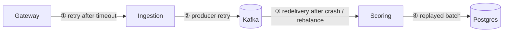

# 12 · Idempotency & "exactly-once"

> **Status:** 📝 Planned: [Feature 002](../../specs/002-rate-limiting-idempotency/spec.md) (API idempotency keys), [Feature 003](../../specs/003-rule-based-scoring/spec.md) (consumer dedupe), [Feature 004](../../specs/004-persistence-jdbc-batch/spec.md) (`ON CONFLICT`)

## The core truth
Over an unreliable network you get **at-most-once** (may lose) or **at-least-once** (may duplicate). "Exactly-once" in practice means **at-least-once delivery + idempotent processing**.

## Where duplicates come from in this system, and the defence at each hop

| # | Duplicate source | Defence |
|---|------------------|---------|
| ① | Client didn't get our `202` and retries | `Idempotency-Key` header → `SET idem:{key} NX EX 86400` → replay the original response |
| ② | Producer retries after a lost ack | `enable.idempotence=true` (broker dedupes by PID + sequence) ✅ *implemented* |
| ③ | Consumer crashed before committing the offset | Dedupe on `eventId` (`SET processed:{eventId} NX`) |
| ④ | Same batch re-inserted | `UNIQUE(transaction_id)` + `ON CONFLICT DO NOTHING` |

## Idempotency-key details (Stripe-style)
- Store **a hash of the request body** with the key. The same key with a different body is client misuse, so return `422`.
- Two concurrent requests with the same key: the first `SET NX` wins, and the other sees "in-flight" and returns `409`, or waits and replays the result.
- TTL bounds storage (24h is typical).

## Kafka transactions (EOS)
Kafka's `transactional.id` + `read_committed` give exactly-once for **consume → process → produce within Kafka**. Once a side effect leaves Kafka (DB write, email), you are back to idempotent consumers. That's why we rely on idempotent handlers rather than Kafka transactions alone.

## Interview questions

Is PUT idempotent? Is POST?

By HTTP semantics, PUT and DELETE are idempotent, and POST is not. Idempotency keys make a POST safely retryable.

