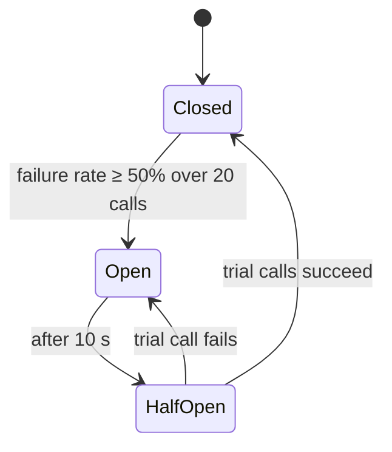

# 13 · Resilience patterns

> **Status:** ✅ Implemented in [Feature 010](../../specs/010-resilience/spec.md) (plus timeouts and 503/Retry-After since [Feature 001](../../specs/001-transaction-ingestion/spec.md), bulkhead in [Feature 006](../../specs/006-ml-assisted-scoring/spec.md))
> **Code:** [`platform-messaging`](../../platform-messaging/src/main/java/com/fraudplatform/messaging) (outbox, jittered backoff, DLT replay), [`CircuitBreakerMlScorer`](../../scoring-service/src/main/java/com/fraudplatform/scoring/infrastructure/ml/CircuitBreakerMlScorer.java), [`TimeoutConfigurationTest`](../../scoring-service/src/test/java/com/fraudplatform/scoring/infrastructure/config/TimeoutConfigurationTest.java) · [ADR-0007](../adr/0007-platform-messaging-library.md)

| Pattern | Problem | In this repo |
|---------|---------|--------------|
| **Timeout** | A call hangs forever and holds resources | Every outbound call has one: Redis, Hikari, PG `statement_timeout`, Kafka request/delivery, outbox ack. `TimeoutConfigurationTest` in each service fails the build if one is removed ✅ |
| **Retry + exponential backoff + jitter** | Transient failures. Retrying in lockstep causes thundering herds. | `JitteredExponentialBackOff` (200 ms·2ⁿ ± 50%, 3 retries) in every Kafka error handler ✅ |
| **Dead-letter topic** | A poison message blocks a partition forever | Non-retryable → DLT at once, transient → DLT after retries. `POST /admin/dlt/replay` re-publishes once fixed ✅ |
| **Circuit breaker** | Calling a failing dependency wastes resources and slows recovery | Resilience4j around the model: ≥50% failures or slow calls → OPEN → rules-only, without calling it ✅ |
| **Bulkhead** | One slow dependency exhausts all threads or connections | `Semaphore` around the model, `Semaphore`-bounded account fan-out ([concept 08](08-concurrency-primitives.md)) ✅ |
| **Fallback / graceful degradation** | Partial failure shouldn't mean total failure | Rules-only scoring. Rate limiter, idempotency and cache fail open/soft. ✅ |
| **Transactional outbox** | Writing the DB and Kafka separately can diverge | Alerts (scoring) and resolutions (alerts) are written to `outbox` in the business transaction, and a single active relay publishes them ✅ |
| **Backpressure** | Producers outpace consumers | Kafka absorbs bursts. Bounded queues. 429s at the edge. ✅ |
| **Graceful shutdown** | Deploys drop in-flight work | `server.shutdown=graceful` + bounded phase timeout. The relay drains its batch, SSE streams close first. ✅ |

## Circuit breaker states


## Transactional outbox
```mermaid
sequenceDiagram
    participant SC as scoring-service
    participant DB as PostgreSQL
    participant RL as Outbox relay
    participant K as Kafka
    SC->>DB: BEGIN; INSERT risk_score; INSERT outbox(event); COMMIT
    loop poll every 100 ms (or CDC via Debezium)
        RL->>DB: SELECT … FROM outbox WHERE sent_at IS NULL ORDER BY id LIMIT 500 FOR UPDATE SKIP LOCKED
        RL->>K: send (idempotent producer)
        RL->>DB: UPDATE outbox SET sent_at = now()
    end
```
### How this repo's relay works, and why
- **One active relay per service** via `pg_try_advisory_xact_lock`. Other instances' relays return immediately and take over within one poll interval if the leader dies, because the lock dies with its transaction. Several relays sharing the work with `FOR UPDATE SKIP LOCKED` would scale throughput, but two relays could then publish two events **for the same key** out of order.
- **Delete after ack** (in the same transaction that read the rows), so the table never bloats.
- **At-least-once:** a crash after the Kafka ack but before the DB commit re-sends the batch. Consumers are idempotent: deterministic alert ids, `ON CONFLICT DO NOTHING`, processed markers.

| `OutboxIT` test | Proves |
|-----------------|--------|
| `rollbackPublishesNothing` | No event for a business transaction that didn't commit |
| `requiresTransaction` | Appending outside a transaction is refused, so the bug can't creep in |
| `survivesKafkaOutage` | Broker down after commit → rows survive → delivered **in order** when it's back |
| `twoRelaysNoDuplicates` | Two racing relays, 200 messages → exactly 200, in order |

### Circuit breaker states (as configured)
| | |
|-|-|
| Window | last 20 calls |
| Opens at | ≥ 50% failures **or** ≥ 50% calls slower than 100 ms |
| While OPEN | model not called; `ml_fallback_total{reason="circuit_open"}` |
| Half-open | after 10 s, 5 trial calls |

## Interview questions
<details><summary>Why add jitter to retries?</summary>

Without it, all clients that failed together retry together, which synchronises load spikes and re-overloads the recovering service. Randomised delays spread the retries out.
</details>

<details><summary>Explain the dual-write problem.</summary>

Writing to the DB and then publishing to Kafka are two separate systems with no shared transaction. A crash between them leaves them inconsistent. The outbox makes the DB the only write, and the event is derived from it reliably.
</details>
