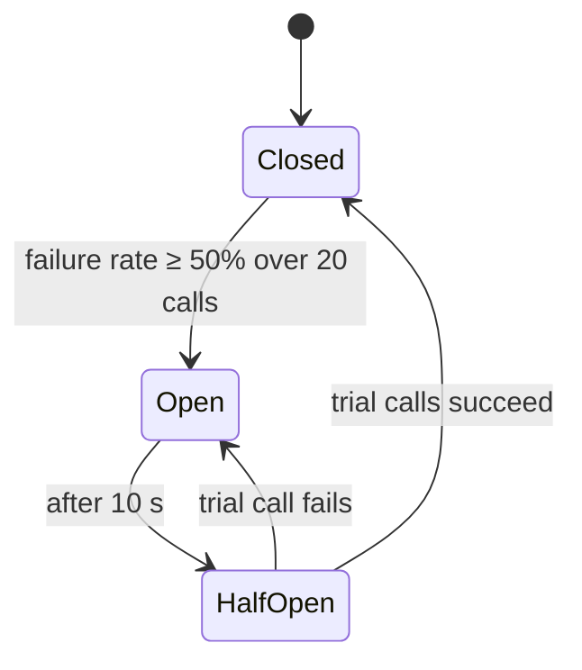

# 13 · Resilience patterns

> **Status:** 📝 Planned: [Feature 010](../../specs/010-resilience/spec.md) · partially present: publish timeout + 503/Retry-After in [Feature 001](../../specs/001-transaction-ingestion/spec.md)

| Pattern | Problem | In this repo |
|---------|---------|--------------|
| **Timeout** | A call hangs forever and holds resources | Every outbound call has one. Kafka publish: 5 s → 503 ✅ |
| **Retry + exponential backoff + jitter** | Transient failures. Retrying in lockstep causes thundering herds. | Kafka consumer `DefaultErrorHandler` |
| **Dead-letter topic** | A poison message blocks a partition forever | `*.DLT` after N retries, with a replay endpoint |
| **Circuit breaker** | Calling a failing dependency wastes resources and slows recovery | Resilience4j around the ML scorer → rules-only fallback |
| **Bulkhead** | One slow dependency exhausts all threads or connections | `Semaphore` per dependency ([concept 08](08-concurrency-primitives.md)) |
| **Fallback / graceful degradation** | Partial failure shouldn't mean total failure | Rules-only scoring, rate limiter fails open |
| **Transactional outbox** | Writing the DB and Kafka separately can diverge | Score + `outbox` row in one DB transaction, then a relay to Kafka |
| **Backpressure** | Producers outpace consumers | Kafka absorbs bursts. Bounded queues. 429s at the edge. |

## Circuit breaker states


## Transactional outbox
```mermaid
sequenceDiagram
    participant SC as scoring-service
    participant DB as PostgreSQL
    participant RL as Outbox relay
    participant K as Kafka
    SC->>DB: BEGIN; INSERT risk_score; INSERT outbox(event); COMMIT
    loop poll every 100 ms (or CDC via Debezium)
        RL->>DB: SELECT … FROM outbox WHERE sent_at IS NULL ORDER BY id LIMIT 500 FOR UPDATE SKIP LOCKED
        RL->>K: send (idempotent producer)
        RL->>DB: UPDATE outbox SET sent_at = now()
    end
```
`FOR UPDATE SKIP LOCKED` lets several relay instances share the work without double-sending.

## Interview questions
<details><summary>Why add jitter to retries?</summary>

Without it, all clients that failed together retry together, which synchronises load spikes and re-overloads the recovering service. Randomised delays spread the retries out.
</details>

<details><summary>Explain the dual-write problem.</summary>

Writing to the DB and then publishing to Kafka are two separate systems with no shared transaction. A crash between them leaves them inconsistent. The outbox makes the DB the only write, and the event is derived from it reliably.
</details>
