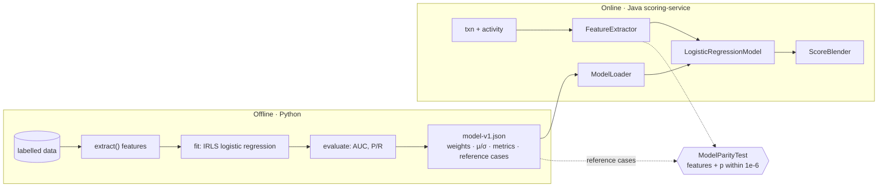

# 15 · ML in a production scoring path

> **Status:** ✅ Implemented in [Feature 006](../../specs/006-ml-assisted-scoring/spec.md)
> **Code:** [`ml/train.py`](../../ml/train.py), [`FeatureExtractor`](../../scoring-service/src/main/java/com/fraudplatform/scoring/domain/ml/FeatureExtractor.java), [`LogisticRegressionModel`](../../scoring-service/src/main/java/com/fraudplatform/scoring/domain/ml/LogisticRegressionModel.java), [`ScoreBlender`](../../scoring-service/src/main/java/com/fraudplatform/scoring/domain/ml/ScoreBlender.java), [`SemaphoreBulkheadMlScorer`](../../scoring-service/src/main/java/com/fraudplatform/scoring/infrastructure/ml/SemaphoreBulkheadMlScorer.java), [`ModelParityTest`](../../scoring-service/src/test/java/com/fraudplatform/scoring/infrastructure/ml/ModelParityTest.java)

## TL;DR
Training the model is the easy part. Here's what makes ML safe on a real-time path:
1. **One feature definition** across training and serving, guarded by a parity test.
2. **A versioned artifact** that you can trace from every decision back to its model.
3. **A policy for combining** model output with business rules.
4. **Graceful degradation** when the model is slow or broken.

## Offline → online

## Training/serving skew
The most common silent ML bug is a feature computed slightly differently in production than in training: a different log base, local time vs UTC, a currency not converted. The model keeps returning numbers and they are quietly wrong. **Defence:** the training script stores reference inputs with the features and probabilities *it* computed, and the Java build replays them. If someone changes either side alone, CI fails.

## Combining rules and a model
| Policy | Formula | Problem |
|--------|---------|---------|
| Rules only | `rule` | Misses novel patterns |
| Model only | `100p` | Opaque. Regulators and analysts need reasons. |
| Weighted blend | `0.6·rule + 0.4·100p` | A confident-but-wrong model can **dilute** a clear rule hit |
| **Escalate-only blend** ✅ | `max(rule, 0.6·rule + 0.4·100p)` | The model adds recall and rules keep authority |

## Degradation: the bulkhead
Inference is CPU-bound (or a network call, once it's a model server). With virtual threads there's no pool size to bound concurrent calls, so a `Semaphore(32)` does it explicitly. A caller that can't get a permit within 20 ms scores **rules-only** and increments `ml_fallback_total{reason}`. Under overload you lose some recall, which is acceptable. You don't get unbounded latency, which isn't.

## What a production system adds
- **Monitoring:** feature distributions and score drift (PSI), alert rate by model version, and delayed-label precision once chargebacks arrive.
- **Shadow / champion-challenger:** score with the new model in parallel and log it, without letting it act.
- **Model registry:** versioned artifacts with lineage (data snapshot, code commit, metrics).
- **Feature store:** shared, point-in-time-correct features for training and serving.

## Interview questions

How do you deploy a new model version safely?

Run it in shadow mode first: score in parallel and log both versions. Compare score distributions and alert volumes. Then canary it to a fraction of traffic, and keep the model version on every decision so it can be audited and rolled back.

Your model's precision dropped this week. What do you check?

First, data drift in the input features (a new merchant mix, a currency feed failure that leaves features at defaults). Then label delay, since recent fraud labels arrive late. Then concept drift (fraudsters adapted). Then pipeline bugs, i.e. skew introduced by a recent change.

Why logistic regression and not XGBoost?

It's a deliberate baseline: interpretable coefficients, microsecond inference, a trivial artifact, and easy parity testing. Trees usually win on tabular fraud data, and they would ship through ONNX behind the same `MlScorer` port with the same parity tests.

