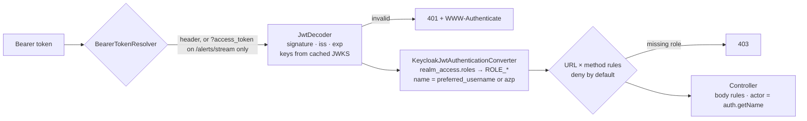

# 16 · API security: OAuth2, JWT and role-based access

> **Status:** ✅ Implemented in [Feature 015](../../specs/015-security/spec.md)
> **Code:** [`platform-security`](../../platform-security/src/main/java/com/fraudplatform/security), each service's `infrastructure/security/SecurityConfig`, [`TestJwts`](../../test-support/src/main/java/com/fraudplatform/testing/TestJwts.java), [dashboard `auth/`](../../dashboard/src/auth), [Keycloak realm](../../infra/keycloak) · [ADR-0008](../adr/0008-platform-security-library.md)

| Concern | Problem | In this repo |
|---------|---------|--------------|
| **Authentication (machines)** | Who is calling, without a human present? | OAuth2 **client credentials**: the gateway trades its client id + secret for a 5-minute JWT ✅ |
| **Authentication (people)** | Signing in from a browser that can't keep a secret | **Authorization code + PKCE** (public client). The code is useless without the verifier, which never leaves the tab ✅ |
| **Token validation** | Checking a token without calling the IdP on every request | Resource servers verify the signature with **cached JWKS keys**, plus `iss`, `exp` and `nbf` ✅ |
| **Authorization** | Who may do what | Realm roles → `ROLE_*` authorities. Deny-by-default URL × method rules per service, and one body-dependent check (closing an alert) in the controller ✅ |
| **Trusted identity** | Headers like `X-Client-Id` / `X-Actor` can be forged | Quota key = `azp` claim, audit actor = `preferred_username`. Both are signed by the IdP ✅ |
| **SSE and tokens** | `EventSource` can't set headers | `?access_token=` accepted on **one** path only. The gateway logs that path without its query string ✅ |
| **PII in logs** | Logs flow to third-party tools and live for months | `Pii.maskAccount` → `acc-****7788`, asserted by a log-capture test ✅ |
| **Browser hardening** | Clickjacking, MIME sniffing, cross-origin calls | Spring Security default headers, CORS limited to the dashboard origin, no cookies → no CSRF ✅ |
| **Operational endpoints** | Actuator leaks internals | Health/Prometheus public for probes. Everything else needs `OPS`; the edge returns 404 for `/actuator` ✅ |

## Request path

## Why one issuer URL for everything
A JWT's `iss` must match what the API expects. Browsers reach Keycloak through the gateway
(`http://localhost:8080/realms/fraud`), while services reach it on the internal network
(`keycloak:8080`). Keycloak runs with a fixed **frontend hostname**, so every token says
`iss=http://localhost:8080/realms/fraud` however it was obtained. Services use that issuer for
validation and fetch keys from the internal JWKS URL. If you mix these up, you get the classic
"works with curl, 401 from the browser" bug.

## Testing without an IdP
- **Slice tests** use Spring Security's `jwt()` post-processor with the real `SecurityConfig`. A
  role matrix (`@CsvSource` of method × path × role → status) documents the rules and fails if
  one changes.
- **Integration tests** replace only the `JwtDecoder` bean with an HS256 one, and `TestJwts` mints
  real signed tokens. The whole filter chain runs, including signature checks, so a tampered
  token returns 401.
- **End to end:** the compose and kind smoke tests get real tokens from Keycloak.

## Pitfalls
- **Trusting identity headers**: `X-User`, `X-Client-Id` and `X-Actor` are client input. Derive
  identity from the verified token, or from a gateway that strips and re-sets those headers.
- **Long-lived tokens**: JWTs can't be revoked before they expire. Keep access tokens short and
  renew them with refresh tokens.
- **Tokens in URLs**: they end up in access logs, browser history and `Referer`. Allow them on
  as few paths as possible, and keep them out of logs.
- **Tokens in `localStorage`**: any XSS can read them. `sessionStorage` limits the exposure to a
  tab's lifetime. A backend-for-frontend with HttpOnly cookies removes it entirely.
- **Hiding a button is not authorization**: the dashboard hides "Confirm fraud" from analysts,
  but the API's 403 is what enforces the rule.
- **Machine tokens per request**: fetching a new token for every call overloads the IdP. Cache
  the token per client and refresh it just before it expires (see the Gatling `Tokens` class).

## Interview questions

Why PKCE for a single-page app?

A browser app can't keep a client secret, so anyone who intercepts the authorization code (a
malicious extension, a logged redirect) could redeem it. With PKCE the app sends a hash of a
random verifier with the authorization request and the verifier itself when it redeems the code,
so an intercepted code is useless on its own. The implicit flow, which returned tokens in the URL
fragment, is deprecated for this reason.

How does a resource server validate a JWT without calling the IdP?

It fetches the IdP's public keys (JWKS) once and caches them, then checks the signature locally
against the key named by the token's `kid`, followed by `iss`, `exp`/`nbf` and optionally `aud`.
An unknown `kid` (after key rotation) triggers a refetch. The trade-off is revocation: a token
stays valid until it expires, unless you add introspection (a network call per request) or a
deny-list.

Authentication vs authorization? Where should each happen?

Authentication establishes who is calling (a valid token); authorization decides what they may
do (roles and rules). Authenticate at every service (defense in depth: don't trust the network),
and authorize as close to the data as possible. Coarse rules go in the filter chain;
data-dependent rules (here, the target status in the body) go in the handler or use case.

Roles vs scopes?

Scopes describe what a **client** application may do on a user's behalf (consented delegation,
e.g. `alerts:read`). Roles describe what a **subject** is allowed to do in the organization. A
machine with client credentials has no user, so either works. For analysts, roles model the job
function, which is why this platform uses realm roles.

How do you stop a client from evading per-client rate limits?

Key the limiter on an identity the client can't choose: the authenticated client id (`azp`)
from a verified token, not a header. Unauthenticated traffic gets a coarse per-IP limit at the
edge, before any expensive work.

