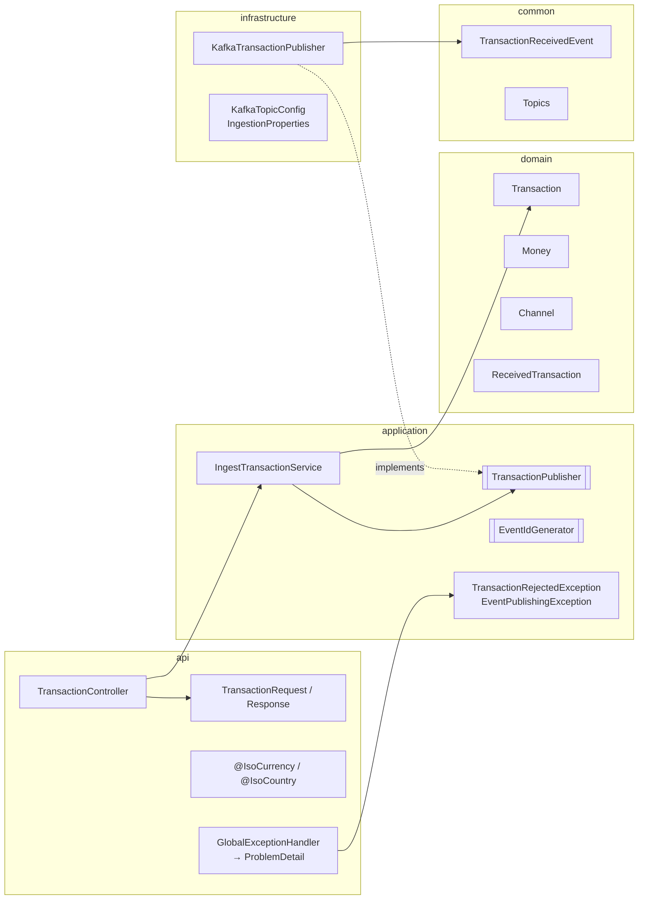

# Plan — Feature 001 Transaction ingestion API

## 1. Approach
A thin REST adapter validates the request DTO (Bean Validation) and maps it to an immutable domain `Transaction`. The application service applies the clock-skew business rule, stamps `eventId` and `receivedAt`, and calls the `TransactionPublisher` **port**. The Kafka adapter maps the domain object to the shared `TransactionReceivedEvent` contract, serialises it to JSON, and sends it keyed by `accountId`, blocking (on a virtual thread) until the broker acknowledges or the timeout expires.

## 2. Components

## 3. Contracts

**Kafka**

| Property | Value |
|----------|-------|
| Topic | `transactions.received.v1` (12 partitions locally configurable) |
| Key | `accountId` (String) |
| Value | JSON `TransactionReceivedEvent` |
| Headers | `event-type: TransactionReceived`, `schema-version: 1` |

**Producer configuration**

| Setting | Value | Why |
|---------|-------|-----|
| `acks` | `all` | Leader waits for all in-sync replicas |
| `enable.idempotence` | `true` | Broker de-duplicates producer retries (PID + sequence number) |
| `delivery.timeout.ms` | 5000 | Upper bound on retries, aligned with the HTTP publish timeout |
| `linger.ms` | 5 | Small batching window, which improves throughput at negligible latency cost |
| `compression.type` | `lz4` | Cheap CPU, smaller network and disk use |

**Errors** (RFC 9457 `application/problem+json`)

| Status | `type` suffix | When |
|--------|---------------|------|
| 400 | `validation-error` | Bean Validation failures, with an `errors[]` array of `{field, message}` |
| 400 | `malformed-request` | Unparseable JSON or wrong types |
| 400 | `transaction-rejected` | Business-rule rejection (future timestamp) |
| 503 | `publish-failed` | Kafka not acknowledged within the timeout, with `Retry-After: 1` |

## 4. Key decisions & trade-offs
| Decision | Alternatives | Why |
|----------|--------------|-----|
| Wait for the broker ack before `202` | Fire-and-forget | Accepting without durability would silently lose transactions |
| Block on `future.get(timeout)` | Return `CompletableFuture` from the controller | Virtual threads make blocking cheap, and the code stays linear |
| Serialise JSON ourselves (`JsonMapper` → `StringSerializer`) | Spring Kafka `JsonSerializer` with type headers | No Java class names leaking onto the wire, and consumers in any language can read it |
| The domain has no Jackson/Spring | Annotate domain classes | Hexagonal rule. The domain stays testable and portable. |
| Clock-skew check in the application service | Custom validator in api | It is a business rule that needs `Clock`, and it is tested without HTTP |

## 5. Test strategy
| AC | Test |
|----|------|
| AC-001-01 | `TransactionControllerTest`, `IngestTransactionServiceTest` |
| AC-001-02 | `KafkaTransactionPublisherTest` (unit), `TransactionIngestionIT` (real Kafka) |
| AC-001-03, 04, 07 | `TransactionControllerTest` |
| AC-001-05 | `IngestTransactionServiceTest`, `TransactionControllerTest` |
| AC-001-06 | `KafkaTransactionPublisherTest`, `TransactionControllerTest` |
| AC-001-08 | `TransactionIngestionIT` |

## 6. Risks
- **The broker acks, but the HTTP response is lost**: the client retries and the transaction is duplicated. Mitigated by idempotency keys (Feature 002) and consumer-side dedupe (Feature 003).
