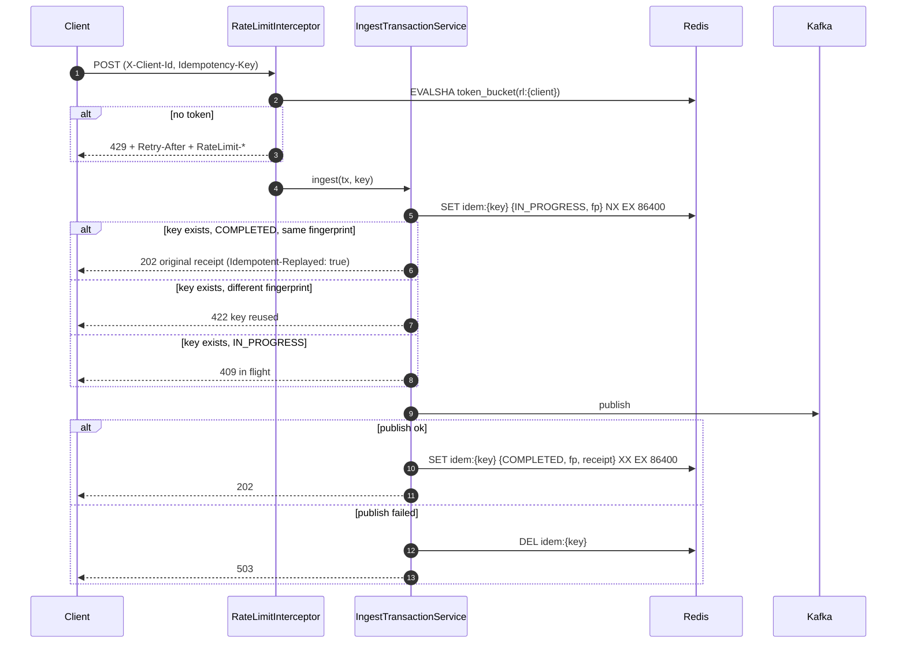

# Plan — Feature 002 Distributed rate limiting & idempotency

## 1. Approach
Both concerns live at the **edge** of ingestion and share **Redis** as the coordination point, so every instance behind the load balancer sees the same state.

- **Rate limiting:** a Spring MVC `HandlerInterceptor` (api layer) asks the `RateLimiter` port for a decision. The Redis adapter runs a **token-bucket Lua script**, so the read-refill-consume-write sequence is atomic on the server in one round trip.
- **Idempotency:** the use case claims the `Idempotency-Key` through the `IdempotencyStore` port (`SET NX`) *before* publishing. Then it either completes the record with the receipt, or releases it on failure so the client can retry.

## 2. Components
| Layer | New / changed |
|-------|---------------|
| domain | `Transaction.fingerprint()`: SHA-256 over the canonical field values |
| application | ports `RateLimiter`, `IdempotencyStore`; `RateLimitDecision`, `IdempotencyRecord`; exceptions `IdempotencyKeyReusedException`, `IdempotentRequestInProgressException`; `IngestTransactionService.ingest(tx, key)` |
| api | `RateLimitInterceptor`, `WebConfig`; handler mappings for 429/409/422; `Idempotency-Key` header + `Idempotent-Replayed` response header |
| infrastructure | `RedisTokenBucketRateLimiter` + `token_bucket.lua`; `RedisIdempotencyStore`; `RateLimitProperties` |

## 3. Contracts
| Status | Problem type | When |
|--------|-------------|------|
| 429 | `rate-limited` | Bucket empty. Headers: `Retry-After`, `RateLimit-Limit`, `RateLimit-Remaining` |
| 409 | `idempotency-in-progress` | Same key is currently being processed |
| 422 | `idempotency-key-reused` | Same key, different body |

Redis keys: `rl:{clientId}` (hash: tokens, ts), `idem:{key}` (JSON string, TTL 24h).

## 4. Key decisions
| Decision | Alternatives | Why |
|----------|--------------|-----|
| Token bucket | Fixed / sliding window | Allows controlled bursts, O(1) memory |
| Lua script, Redis `TIME` | Java read-modify-write; app clock | Atomic, with no clock skew between instances |
| Fail **open** on Redis errors (both limiter and idempotency) | Fail closed | Dropping legitimate payments costs more than briefly exceeding a quota. Downstream dedupe (003/004) still catches duplicates. A metric + warning makes it visible. |
| Claim before publish, release on failure | Check after publish | Prevents two concurrent publishes for one key |
| Interceptor in api, decision in a port | Servlet filter calling Redis directly | Keeps Redis out of the api layer (ArchUnit) |

## 5. Test strategy
| AC | Test |
|----|------|
| AC-002-01, 02, 03 | `RedisTokenBucketRateLimiterIT` (real Redis, 2 limiter instances, 100 concurrent virtual threads) |
| AC-002-01 (HTTP contract) | `RateLimitInterceptorTest` (`@WebMvcTest`) |
| AC-002-04 | `RedisTokenBucketRateLimiterTest` (Redis throws → allowed + counter) |
| AC-002-05, 06, 07 | `IngestTransactionServiceTest` (unit), `RedisIdempotencyStoreIT`, `IdempotencyIT` (HTTP → Redis → Kafka) |
