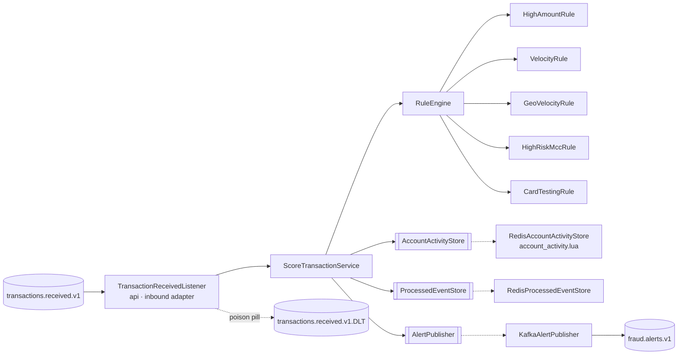

# Plan — Feature 003 Rule-based scoring engine

## 1. Approach
A new **scoring-service** consumes `transactions.received.v1` in consumer group `scoring`. For each event it:

1. skips it if `processed:{eventId}` exists (redelivery),
2. records the transaction in the account's **activity windows** in Redis and reads back the counts (one Lua call),
3. runs every `FraudRule` (pure functions of *transaction + activity*) and sums the weights into a 0–100 score,
4. publishes a `FraudAlertEvent` to `fraud.alerts.v1` when the decision is `REVIEW` or `DECLINE`,
5. marks the event processed.

Rules are **pure domain code**: all I/O happens before evaluation, through the `AccountActivityStore` port. That makes every rule a fast, deterministic unit test, and adding a rule means adding one class (open/closed principle).

## 2. Account activity in Redis (one Lua round trip)

| Key | Type | Content | Used by |
|-----|------|---------|---------|
| `velocity:{acc}` | ZSET score=occurredAt ms, member=eventId | All txns in the last 24h | VelocityRule (60 s), ML features 1h/24h (F006) |
| `small:{acc}` | ZSET | Txns under the card-testing threshold | CardTestingRule (5 min) |
| `last:{acc}` | HASH country, occurredAt | Previous transaction | GeoVelocityRule |

- **Event time, not processing time.** Windows use `occurredAt`, so replaying a backlog gives the same answers as live processing.
- **Idempotent by construction.** The ZSET member is `eventId`, so a redelivered event doesn't inflate the counts.
- `last:{acc}` is only overwritten by a *newer* transaction, which protects against out-of-order events.

## 3. Contracts
`fraud.alerts.v1`, key `accountId`, JSON `FraudAlertEvent` (schemaVersion 1) carrying the transaction, `ruleScore`, `riskScore`, `decision`, `ruleHits[]` and `scoredAt`.

Consumer settings: `isolation.level=read_committed`, `auto.offset.reset=earliest`, the error handler sends non-retryable failures (unparseable JSON, invalid data) **straight to the DLT** with diagnostic headers.

## 4. Key decisions
| Decision | Alternatives | Why |
|----------|--------------|-----|
| Mark processed **after** side effects | `SET NX` before | `SET NX` first = at-most-once on crash. After = at-least-once + idempotent effects |
| Rules pure, activity fetched up front | Rules query Redis themselves | Deterministic unit tests, one Redis round trip instead of one per rule |
| Rule weights summed, capped at 100 | Weighted max, ML only | Explainable to analysts and regulators. ML is blended in F006. |
| Listener in `api` (inbound adapter) | `infrastructure` | Consistent hexagonal rule: inbound = api |
| Thresholds in config (`fraud.scoring.rules.*`) | Hard-coded | Tunable per environment without a code change |

## 5. Test strategy
| AC | Test |
|----|------|
| 01, 07 | `RuleEngineTest` |
| 02–06 | One unit test class per rule |
| 03, 04, 06 (Redis side) | `RedisAccountActivityStoreIT` |
| 08 | `ScoreTransactionServiceTest`, `ScoringPipelineIT.duplicateDeliveryRaisesOneAlert` |
| 09 | `ScoringPipelineIT.poisonPillGoesToDlt` |
| 10 | `ScoreTransactionServiceTest`, `ScoringPipelineIT.velocityBurstRaisesAlert` |
