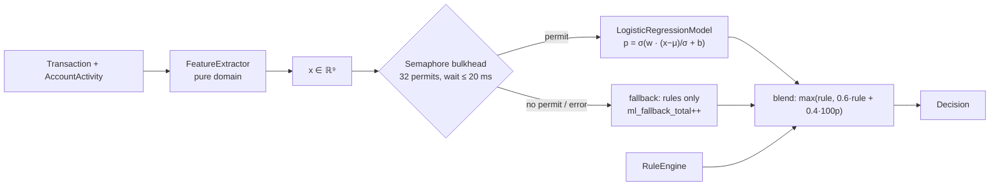

# Plan — Feature 006 ML-assisted scoring

## 1. Approach

- **Training (offline, Python):** `ml/train.py` generates a labelled synthetic dataset (≈5% fraud with realistic patterns), standardises the features, fits logistic regression by Newton's method (IRLS), evaluates on a hold-out set, and writes `model-v1.json` with the weights, means/stds, metrics and **reference cases**.
- **Serving (online, Java):** the same feature definitions are reimplemented in `FeatureExtractor`. `ModelParityTest` replays the reference cases and must match Python to 1e-6. This guards against **training/serving skew**, the classic ML-in-production bug.
- **Isolation:** inference sits behind the `MlScorer` port. Swapping it for an ONNX runtime or a remote model server touches only infrastructure.

## 2. Features (shared contract between Python and Java)
| # | Name | Definition |
|---|------|------------|
| 0 | `log_amount_usd` | ln(1 + amount × usdRate) |
| 1 | `hour_sin` | sin(2π · hourUTC / 24) |
| 2 | `hour_cos` | cos(2π · hourUTC / 24): cyclical, so 23:00 and 00:00 are close |
| 3 | `high_risk_mcc` | 1 if MCC in the high-risk set |
| 4 | `card_not_present` | 1 if channel = CARD_NOT_PRESENT |
| 5 | `log_tx_count_1h` | ln(1 + count 1h) |
| 6 | `log_tx_count_24h` | ln(1 + count 24h) |
| 7 | `country_changed` | 1 if previous country exists and differs |
| 8 | `log_small_tx_5m` | ln(1 + small-amount count 5 min) |

## 3. Key decisions
| Decision | Alternatives | Why |
|----------|--------------|-----|
| Logistic regression | Gradient boosting, neural nets | Interpretable coefficients, microsecond inference, trivially portable as JSON. A good baseline before anything heavier. |
| In-process inference | Python model server | No network hop on the hot path. The port keeps the option open. |
| `max(rule, blend)` | Plain weighted blend | Rules encode known fraud. A low ML score must not dilute them. |
| Semaphore bulkhead + fallback | Unbounded calls | Inference is CPU-bound. With virtual threads there is no natural limit, so the semaphore provides one. Overload degrades to rules-only instead of queueing. |
| Reference cases in the model file | Separate fixtures | The parity check travels with the model version |

## 4. Test strategy
| AC | Test |
|----|------|
| 01 | `FeatureExtractorTest` |
| 02, 06 | `ModelParityTest` (Java vs Python reference cases to 1e-6), `LogisticRegressionModelTest` |
| 03 | `RiskAssessmentBlendTest`, `ScoreTransactionServiceTest`, `JdbcAssessmentRepositoryIT` (ML columns), `FraudAlertEventContractTest` (old payload still parses) |
| 04 | ArchUnit: domain has no ML/framework imports; `MlScorer` is a port |
| 05 | `SemaphoreBulkheadMlScorerTest` (100 callers, permits=4 → high-water mark ≤ 4, fallbacks counted) |
