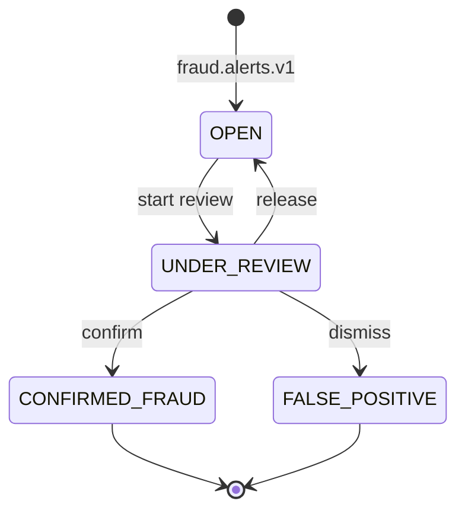
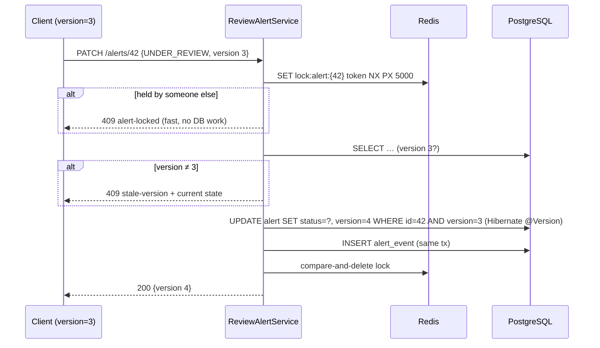

# Plan — Feature 007 Alert management API

## 1. Approach
A new **alert-service** owns the `alerts` schema.

| Path | Mechanism |
|------|-----------|
| Ingest | Kafka listener on `fraud.alerts.v1` (group `alerts`). JDBC `INSERT … ON CONFLICT DO NOTHING`, keyed by the deterministic `alertEventId` and `UNIQUE(transaction_id)` |
| Query | JPA, with N+1 avoided by fetching rule hits for the whole page in **one** query. Offset (with count) or keyset (`after` cursor) pagination. |
| Review | Redis lock (layer 1) + JPA `@Version` (layer 2) + `alert_event` audit row in the same transaction |
| Resolution | `AlertResolvedEvent` → `fraud.alert-resolutions.v1` → scoring clears the account on `FALSE_POSITIVE` |

## 2. Two-layer concurrent-write protection

## 3. N+1, made visible
| Approach | Statements for 50 alerts |
|----------|-------------------------|
| Naive: page query, then `alert.getRuleHits()` per row (lazy) | 1 + 50 |
| Ours: page query + `SELECT h FROM hit h WHERE h.alert.id IN (:ids)` + count | 3 |

`spring.jpa.open-in-view=false`: OSIV hides N+1 problems by lazy-loading during JSON rendering, and it holds a DB connection for the whole request.

## 4. Key decisions
| Decision | Alternatives | Why |
|----------|--------------|-----|
| JDBC for ingest, JPA for reads and review | All JPA | Idempotent `ON CONFLICT` insert is natural in SQL. `@Version` and entity graphs are where JPA shines. |
| Keyset pagination for the live queue | Offset only | `OFFSET 10000` scans and discards 10k rows, and rows shift as new alerts arrive. Keyset is O(page) and stable. |
| Client sends `version` | Server-side lock only | It's HTTP optimistic concurrency (like `If-Match`), so it spans the analyst's think time |
| Publish the resolution after commit | Inside the transaction | Never announce an uncommitted change. The remaining dual-write gap is closed by the outbox in Feature 010. |
| Severity derived in alert-service | Sent by scoring | Queue policy belongs to the alerting domain |

## 5. Test strategy
| AC | Test |
|----|------|
| 01 | `AlertIngestionIT` (Kafka → DB, duplicate → one row) |
| 02 | `AlertQueryIT` (offset + keyset ordering), `AlertControllerTest` |
| 03 | `AlertQueryIT.nPlusOne…` (Hibernate statistics: naive 1+N vs ours ≤ 3) |
| 04 | `AlertStatusTest`, `ReviewAlertServiceTest` |
| 05 | `ReviewAlertServiceTest`, `RedisAlertLockIT` |
| 06 | `AlertConcurrencyIT.layerTwoHoldsWithoutLock` |
| 07, 08 | `AlertConcurrencyIT.fiftyConcurrentPatches` |
| 09 | `ReviewAlertServiceTest`, `AlertIngestionIT`, scoring `AlertResolutionListenerTest` + `ScoringPipelineIT` |
| 10 | `AlertControllerTest`, `AlertQueryIT` |
