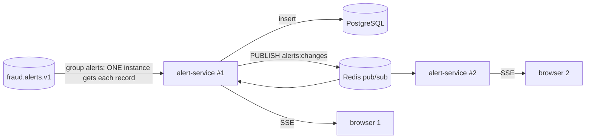

# Plan — Feature 008 Real-time analyst dashboard

## 1. Backend additions (alert-service)

- **Why pub/sub?** Kafka consumer groups split records between instances (load balancing). SSE clients, however, are connected to arbitrary instances, so every instance must see every change. Redis pub/sub is a fire-and-forget broadcast. A missed message only means a browser refetches on reconnect, because the queue in PostgreSQL is the source of truth.
- `AlertChangeBus` port (publish/subscribe) → `RedisAlertChangeBus`. The use cases publish `CREATED` after insert and `UPDATED` after a transition.
- `GET /api/v1/alerts/stream`: `SseEmitter` per client, event ids, a heartbeat comment every 15 s (keeps proxies/LBs from closing idle connections), and dead emitters removed on error.
- `GET /api/v1/alerts/stats`: one `GROUP BY` query.

## 2. Frontend (`dashboard/`)
| Concern | Choice |
|---------|--------|
| Build | Vite 8 + React 19 + TypeScript 5.9 (strict) |
| Server state | TanStack Query: caching, refetch, `useInfiniteQuery` for keyset "Load more" |
| Live updates | `EventSource` → merges into the query cache (no duplicate fetches) |
| Concurrency UX | PATCH with `version`. On 409, show the reason and refetch, never silently overwrite. |
| Tests | Vitest + Testing Library + MSW (network mocked at the fetch layer, components untouched) |
| Quality | ESLint (typescript-eslint, react-hooks), Prettier, `tsc --noEmit` in CI |
| a11y | Severity shown as text + icon (never colour alone), keyboard navigation (↑/↓, Enter), labelled controls |

```
dashboard/src
├── api/          typed fetch client + types mirroring the REST contract
├── hooks/        useAlertQueue, useAlertStream, useAlertDetails, useReviewAlert, useStats
├── components/   KpiBar, AlertQueue, AlertDetail, SeverityBadge, Toast
└── test/         MSW handlers, fake EventSource
```

## 3. Test strategy
| AC | Test |
|----|------|
| 02 (backend) | `AlertStreamIT`: subscribe to SSE, ingest via Kafka, receive `alert.created`. `RedisAlertChangeBusIT`: two bus instances both receive. |
| 02 (UI) | `AlertQueue.test.tsx`: fake EventSource pushes an alert → it appears at the top |
| 03 | `AlertQueue.test.tsx`: filters, load more |
| 04, 05 | `AlertDetail.test.tsx`: details, history, actions, 409 → message + refetch |
| 06 | `KpiBar.test.tsx`, `AlertStatsIT` |
| 08 | keyboard navigation test, severity text labels |
