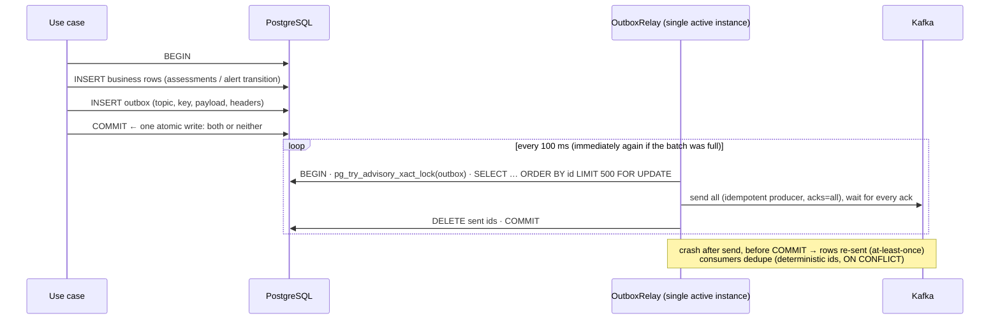

# Plan — Feature 010 Resilience

## 1. The dual-write problem, and the outbox
Before: scoring committed the assessment, **then** sent the alert to Kafka. A crash or a Kafka outage between the two lost the alert, or (with retries and replays) duplicated it. alert-service had the same gap for resolution events.

| Decision | Alternatives | Why |
|----------|--------------|-----|
| Polling relay | CDC (Debezium reading the WAL) | No extra infrastructure. CDC is the documented upgrade path for high volume. |
| One active relay (advisory lock) | `FOR UPDATE SKIP LOCKED` with N relays | N relays can reorder events for the same key. One relay keeps insertion order, and standbys take over within a poll interval. |
| Delete after ack | `sent_at` column | No table bloat or vacuum pressure. Kafka is the record of what was sent. |
| Shared `platform-messaging` library | Copy per service | Infrastructure-only code (no domain). ADR-0007 records the trade-off. |

## 2. Retries, DLT, replay
- `JitteredExponentialBackOff`: 200 ms × 2ⁿ ± 50%, capped at 5 s, 3 retries. Jitter stops consumers that failed together from retrying in lockstep.
- Non-retryable (`InvalidEventException`) goes straight to the DLT (Feature 003).
- **DLT replay:** `POST /admin/dlt/replay?max=100` re-publishes dead letters (key preserved, `kafka_dlt-*` headers stripped) and commits a dedicated consumer group's offset, so each dead letter is replayed once.

## 3. Circuit breaker around the model
`bulkhead( circuitBreaker( model ) )`, Resilience4j:
- OPEN after ≥ 50% failures **or** ≥ 50% slow calls (> 100 ms) over the last 20 calls.
- While OPEN, rules-only (`ml_fallback_total{reason="circuit_open"}`) without even calling the model.
- HALF_OPEN after 10 s with 5 trial calls.

The in-process model rarely fails. The breaker exists for when `MlScorer` becomes a remote model server, and the port stays unchanged.

## 4. Timeouts everywhere
`TimeoutConfigurationTest` (one per service) parses `application.yml` and fails if any outbound call lacks a timeout: Redis command timeout, Hikari connection timeout, PostgreSQL `statement_timeout`, Kafka `request.timeout.ms` / `delivery.timeout.ms`, graceful shutdown phase timeout.

## 5. Test strategy
| AC | Test |
|----|------|
| 01 | `JitteredExponentialBackOffTest` |
| 03 | `DltReplayIT` (scoring) |
| 04 | `OutboxIT` (platform-messaging: atomicity, Kafka down then recovery, rollback, two relays), `ScoreTransactionServiceTest`, `ReviewAlertServiceTest`, pipeline ITs |
| 05 | `CircuitBreakerMlScorerTest` |
| 06 | `TimeoutConfigurationTest` × 3 |
| 07 | `OutboxRelayRunnerTest.stopDrainsInFlightBatch`, `TimeoutConfigurationTest` |
