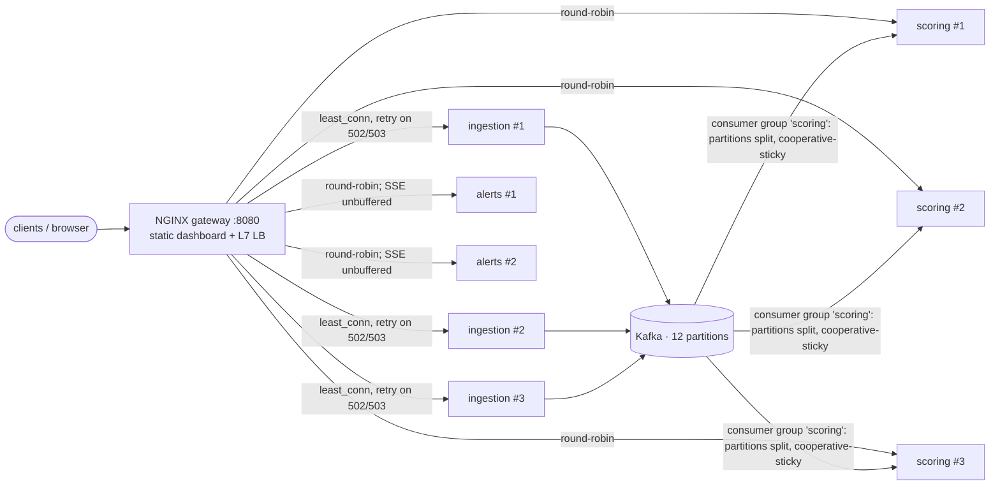

# Plan — Feature 011 Load balancing & horizontal scaling

## 1. Topology

Two kinds of load balancing:

| | HTTP (NGINX) | Kafka (consumer group) |
|-|--------------|------------------------|
| Unit of work | request | partition |
| Algorithm | least_conn / round-robin | group coordinator + assignor |
| Failure handling | passive health check, retry on next upstream | session timeout → rebalance |
| State | none in the services (Redis holds limits, locks, idempotency) | offsets in Kafka |

## 2. Key decisions
| Decision | Alternatives | Why |
|----------|--------------|-----|
| `least_conn` for ingestion | round-robin | Request time varies (it waits for the Kafka ack). Least-conn steers away from a slow instance. |
| `resolve` + `zone` upstreams | static resolution at start | Replicas restart with new IPs. Without re-resolution NGINX keeps sending to dead addresses. |
| Retry POST (`non_idempotent`) on ingestion only | never retry POST | Safe only because of Idempotency-Key and downstream dedupe. Elsewhere it would duplicate transactions. |
| One parameterised Dockerfile, layered jar | buildpacks / one per service | Fast rebuilds (code layer only), non-root user, container-aware heap |
| Profiles: infra-only by default, `--profile app` for the full stack | separate compose files | Developers run services from the IDE against the same infrastructure |

## 3. Test strategy
| AC | Proof |
|----|-------|
| 01, 03 | `infra/smoke-test.sh`: full stack, burst through the gateway → alert in the queue; requests spread across 3 ingestion instances |
| 02 | NGINX config (passive checks, retry); under load in Feature 013 |
| 04 | gateway access log `rid=…`, `X-Request-Id` response header |
| 05 | `HealthProbesIT`: readiness flips to 503 on REFUSING_TRAFFIC while liveness stays UP |
| 06 | `ConsumerGroupRebalanceIT`: 3 × 4 partitions → one leaves → 2 × 6, survivors keep their partitions; `LoggingRebalanceListener` |
