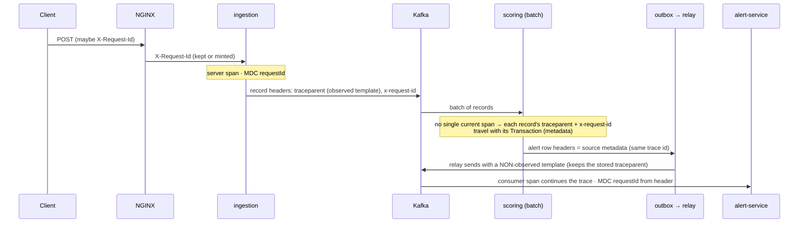

# Plan — Feature 012 Observability

## 1. Signals
| Signal | How | Where to look |
|--------|-----|---------------|
| Metrics | Micrometer → `/actuator/prometheus` → Prometheus (DNS service discovery finds every replica) | Grafana "Fraud Platform — Overview" |
| Traces | Micrometer Tracing → OpenTelemetry bridge → OTLP → Jaeger | Jaeger UI :16686 |
| Logs | Spring Boot structured logging (ECS JSON) with `traceId`, `spanId`, `requestId` in every line | `docker compose logs` / any log shipper |
| Alerts | Prometheus rules (`infra/prometheus/alerts.yml`) | Prometheus :9090/alerts |

## 2. Context propagation, hop by hop

| Pitfall | Fix |
|---------|-----|
| Boot disables tracing in tests | `@AutoConfigureTracing` on the shared `@IntegrationTest` |
| Tracing modules picked by hand had no `Propagator`, so no `traceparent` | Add `micrometer-tracing-bridge-otel` (the starter includes it) |
| Empty OTLP endpoint (`${X:}`) counts as configured → startup failure | Leave it unset in YAML; set it only via the environment |
| An *observed* KafkaTemplate appends its own `traceparent` | Relay (and the trace test) use a plain template |
| Batch listener has no per-record span | Carry trace context as transaction metadata |

## 3. Test strategy
| AC | Test |
|----|------|
| 01, 02 | `ObservabilityIT` (ingestion), `ScoringObservabilityIT`, `AlertObservabilityIT`: scrape `/actuator/prometheus`; `MicrometerScoringMetricsTest`, `MicrometerAlertMetricsTest` |
| 03 | Grafana provisioned from `infra/grafana`; smoke test checks every replica is scraped |
| 04 | ingestion: record has W3C `traceparent`. scoring: alert has the **same trace id** as the source record. alerts: resolution event carries the PATCH's trace context. Smoke test: services visible in Jaeger. |
| 05 | `RequestIdFilterTest`; request id asserted on Kafka records in all three services |
| 06 | `promtool check config` (6 rules); `kafka_dead_letters_total` asserted in `ScoringPipelineIT` |
