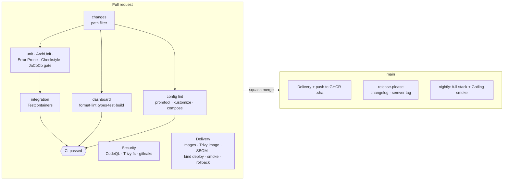

# Plan — Feature 014 CI/CD pipeline

## 1. Pipelines

| Workflow | Trigger | Gate |
|----------|---------|------|
| `ci.yml` | PR, main | `CI passed`: one required check that aggregates jobs skipped by path filters |
| `security.yml` | PR, main, weekly | CodeQL (Java + TS), Trivy on dependencies, gitleaks on full history |
| `delivery.yml` | PR (deployable paths), main | Deploy to kind, smoke test, rollback on failure. Push to GHCR on main. |
| `load-smoke.yml` | nightly, manual | Full compose stack + Gatling SLO assertions |
| `release.yml` | main | release-please opens the release PR (Conventional Commits → semver + changelog) |

## 2. Key decisions
| Decision | Alternatives | Why |
|----------|--------------|-----|
| Deploy to kind **on PRs** | Only after merge | A broken manifest or image should never reach `main` |
| Build once, promote the same image (tag = SHA) | Rebuild per environment | What was tested is what ships |
| Error Prone + curated Checkstyle | SpotBugs, Google style | Error Prone finds real bugs at compile time with few false positives. Style is left to the editor. |
| Trivy `--ignore-unfixed` | Fail on everything | A gate must be actionable. Unfixable CVEs are tracked, not build-breaking. |
| Docker Hub mirror (`mirror.gcr.io`) on runners | Docker Hub login | No secrets needed, no rate limits |
| Aggregated `CI passed` check | Require every job | Path-filtered jobs report "skipped", and branch protection needs one stable name |

## 3. Branch protection (configured in GitHub settings, documented here)
- Require PRs to `main` with **`CI passed`**, **`Build · scan · deploy to kind · smoke · rollback`** and **Security** checks green.
- Require linear history (squash merge), dismiss stale approvals, CODEOWNERS review.
- No direct pushes, no force pushes.
