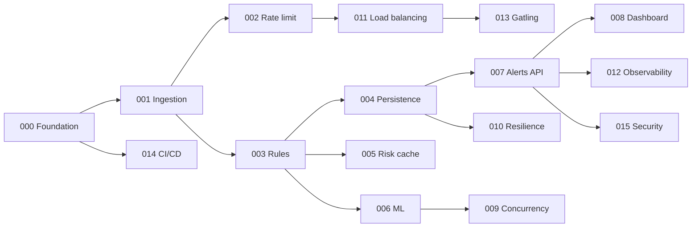

# Feature Specs & Roadmap

This project uses **spec-driven development**: every feature starts as a spec, and code only exists because a spec asked for it. The workflow and the Definition of Done are in the [constitution](../docs/constitution.md).

## Workflow per feature

Templates: [`_templates/`](_templates)

## Roadmap

Features build on each other. Each one is a shippable vertical slice with its own tests.

| #   | Feature | Concepts demonstrated | Status |
|-----|---------|-----------------------|--------|
| 000 | [Project foundation](000-foundation/spec.md) | Monorepo, hexagonal architecture, ArchUnit, CI | ✅ Implemented |
| 001 | [Transaction ingestion API](001-transaction-ingestion/spec.md) | Event-driven decoupling, Kafka producer semantics, validation, virtual threads | ✅ Implemented |
| 002 | [Distributed rate limiting & idempotency](002-rate-limiting-idempotency/spec.md) | Token bucket in Redis + Lua, idempotency keys | ✅ Implemented |
| 003 | [Rule-based scoring engine](003-rule-based-scoring/spec.md) | Kafka consumer groups, strategy pattern, sliding-window velocity in Redis | ✅ Implemented |
| 004 | [Persistence & query performance](004-persistence-jdbc-batch/spec.md) | Flyway, JDBC batch processing, composite & partial indexes | ✅ Implemented |
| 005 | [High-risk account cache](005-high-risk-account-cache/spec.md) | Distributed caching, cache-aside, TTL jitter, stampede protection | ✅ Implemented |
| 006 | [ML-assisted scoring](006-ml-assisted-scoring/spec.md) | Feature engineering, logistic regression, score blending, Semaphore bulkhead | ✅ Implemented |
| 007 | [Alert management API](007-alert-management/spec.md) | N+1 queries, pagination, two-layer concurrent-write protection | ✅ Implemented |
| 008 | [Real-time analyst dashboard](008-react-dashboard/spec.md) | React + TS, SSE, optimistic UI, component testing | ✅ Implemented |
| 009 | [Concurrency deep dive](009-concurrency-deep-dive/spec.md) | Virtual threads vs platform threads, pinning, Semaphore, CompletableFuture, locks | ✅ Implemented |
| 010 | [Resilience](010-resilience/spec.md) | Retries + backoff, DLT, circuit breaker, transactional outbox | ✅ Implemented |
| 011 | [Load balancing & horizontal scaling](011-load-balancing/spec.md) | NGINX, health checks, consumer-group rebalancing | ✅ Implemented |
| 012 | [Observability](012-observability/spec.md) | Micrometer, Prometheus, Grafana, tracing, correlation IDs | ✅ Implemented |
| 013 | [Load testing with Gatling](013-load-testing-gatling/spec.md) | Open vs closed workload models, SLO assertions | 📝 Spec |
| 014 | [CI/CD pipeline](014-ci-cd/spec.md) | Quality gates, container images, supply-chain scanning, release | 📝 Spec |
| 015 | [Security](015-security/spec.md) | OAuth2 resource server, JWT, RBAC, PII masking | 📝 Spec |

